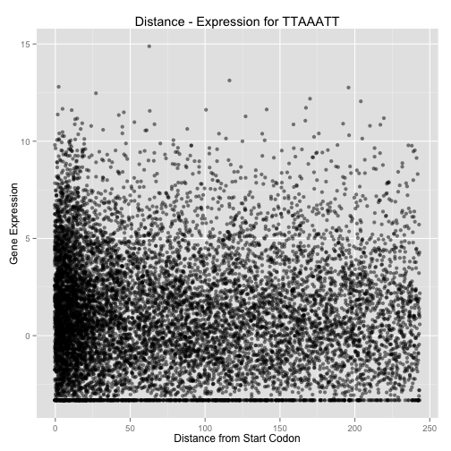

# Correlate distance with motifs #

Loop trough all the files and analyze the results.

First step: loading data

```r
# Load files of genes for each motifs of each species
extract_bi <- dir("../motifs_extraction", full.names = TRUE, pattern = "bi.res$")
extract_ca <- dir("../motifs_extraction", full.names = TRUE, pattern = "ca.res$")
extract_sex <- dir("../motifs_extraction", full.names = TRUE, pattern = "sex.res$")
extract_tet <- dir("../motifs_extraction", full.names = TRUE, pattern = "tet.res$")

# Load expression data
exp_bi = read.table("../../data/biaurelia_RNAseq_xp.tab", h = T)
exp_ca = read.table("../../data/caudatum_RNAseq_xp.tab", h = T)
exp_sex = read.table("../../data/sexaurelia_RNAseq_xp.tab", h = T)
exp_tet = read.table("../../data/tetraurelia_RNAseq_xp.tab", h = T)

# Load motifs name <-> motif correspondance table
motifs = read.table("../15may14consensuscomp.txt", sep = "\t")
head(motifs)
```

```
##             V1     V2 V3      V4 V5         V6 V7      V8
## 1 WGD2ANC00043 motif1  6 Motif 1 38 PBIGNG2963  1  TTTATT
## 2 WGD2ANC00047 motif1  7 Motif 1 50 PBIGNG2688  1 TATAATT
## 3 WGD2ANC00051 motif1  7 Motif 1 50 PBIGNG3029  1 TTAAATT
## 4 WGD2ANC00051 motif2  6 Motif 1 50 PBIGNG3029  1  TTAAAT
## 5 WGD2ANC00055 motif1  7 Motif 1 29 PBIGNG3029  1 ATACTAA
## 6 WGD2ANC00070 motif1  6 Motif 1 41 PBIGNG3030  1  TAAATT
```

```r
colnames(motifs) = c("family", "BF.motif", "BF.size", "MEME.motif", "MEME.size", 
    "gene", "match.ratio", "consensus")

# pvalue threshold to select in the whole file
pval.thre = 0.01
```


Function to treat each files from each list

```r
# Function to use on every file, returns a table of matching genes between
# expression and extracted data
corr.dist.exp <- function(extract_file, expression_file) {
    extract_table = read.table(extract_file, h = F)
    colnames(extract_table) = c("gene_id", "distance", "motifs.number")
    extract_match = extract_table[match(expression_file$gene_id, extract_table$gene_id, 
        nomatch = 0), ]
    extract.merge = merge(extract_match, expression_file)
}

# Function to returns p.value of fitted models
lm.pvalue <- function(table.merged) {
    model = lm(xp ~ distance, data = table.merged)  # Produce a linear model for data
    p.value = summary(model)$coefficients[[8]]
    rsq = summary(model)$adj.r.squared
    list(p.value, rsq)
}
```


Test on *Paramecium biaurelia*, see the number of significant correlations.


```r
bi.pvalues = rep(NA, length(extract_bi))
bi.rsq = rep(NA, length(extract_bi))

for (i in 1:length(extract_bi)) {
    merged = corr.dist.exp(extract_bi[i], exp_bi)
    
    if (length(merged[, 1]) > 2) {
        mod = lm.pvalue(merged)
        p.value = mod[[1]][1]
        rsq = mod[[2]][1]
        bi.pvalues[i] = p.value
        bi.rsq[i] = rsq
    }
}
length(bi.pvalues)
```

```
## [1] 103
```

```r
summary(bi.pvalues)
```

```
##    Min. 1st Qu.  Median    Mean 3rd Qu.    Max.    NA's 
##   0.000   0.000   0.116   0.279   0.532   0.991      10
```

```r
length(subset(bi.pvalues, bi.pvalues < pval.thre))
```

```
## [1] 33
```


For *P. caudatum*


```r
ca.pvalues = rep(NA, length(extract_ca))
ca.rsq = rep(NA, length(extract_ca))

for (i in 1:length(extract_ca)) {
    merged = corr.dist.exp(extract_ca[i], exp_ca)
    
    if (length(merged[, 1]) > 2) {
        mod = lm.pvalue(merged)
        p.value = mod[[1]][1]
        rsq = mod[[2]][1]
        ca.pvalues[i] = p.value
        ca.rsq[i] = rsq
    }
}
length(ca.pvalues)
```

```
## [1] 95
```

```r
summary(ca.pvalues)
```

```
##    Min. 1st Qu.  Median    Mean 3rd Qu.    Max.    NA's 
##   0.000   0.000   0.058   0.258   0.416   0.989       7
```

```r
length(subset(ca.pvalues, ca.pvalues < pval.thre))
```

```
## [1] 36
```


For *P. sexaurelia*


```r
sex.pvalues = rep(NA, length(extract_sex))
sex.rsq = rep(NA, length(extract_sex))

for (i in 1:length(extract_sex)) {
    merged = corr.dist.exp(extract_sex[i], exp_sex)
    
    if (length(merged[, 1]) > 2) {
        mod = lm.pvalue(merged)
        p.value = mod[[1]][1]
        rsq = mod[[2]][1]
        sex.pvalues[i] = p.value
        sex.rsq[i] = rsq
    }
}
length(sex.pvalues)
```

```
## [1] 99
```

```r
summary(sex.pvalues)
```

```
##    Min. 1st Qu.  Median    Mean 3rd Qu.    Max.    NA's 
##   0.000   0.000   0.029   0.218   0.357   0.995       5
```

```r
length(subset(sex.pvalues, sex.pvalues < pval.thre))
```

```
## [1] 44
```


For *P. tetraurelia*

```r
tet.pvalues = rep(NA, length(extract_tet))
tet.rsq = rep(NA, length(extract_tet))

for (i in 1:length(extract_tet)) {
    merged = corr.dist.exp(extract_tet[i], exp_tet)
    
    if (length(merged[, 1]) > 2) {
        mod = lm.pvalue(merged)
        p.value = mod[[1]][1]
        rsq = mod[[2]][1]
        tet.pvalues[i] = p.value
        tet.rsq[i] = rsq
    }
}
length(tet.pvalues)
```

```
## [1] 99
```

```r
summary(tet.pvalues)
```

```
##    Min. 1st Qu.  Median    Mean 3rd Qu.    Max.    NA's 
##   0.000   0.000   0.076   0.240   0.446   0.952       6
```

```r
length(subset(tet.pvalues, tet.pvalues < pval.thre))
```

```
## [1] 42
```


Let see if there are some motifs in common.

```r

# To have indexes of elements
bi.match = match(subset(bi.pvalues, bi.pvalues < pval.thre), bi.pvalues)
ca.match = match(subset(ca.pvalues, ca.pvalues < pval.thre), ca.pvalues)
sex.match = match(subset(sex.pvalues, sex.pvalues < pval.thre), sex.pvalues)
tet.match = match(subset(tet.pvalues, tet.pvalues < pval.thre), tet.pvalues)

# Common elements
common = intersect(intersect(intersect(bi.match, ca.match), sex.match), tet.match)
length(common)
```

```
## [1] 10
```


Let's extract the sequence of conserved motifs

```r
common.motifs = data.frame()
for (i in 1:length(common)) {
    index = common[i]
    filename = extract_bi[index]
    print(filename)
    filename = strsplit(filename, "/")
    filename = filename[[1]][3]
    fam = substr(filename, 1, 12)
    fam.motif = substr(filename, 13, 18)
    common.motifs = rbind(common.motifs, subset(motifs, family == fam & BF.motif == 
        fam.motif))
}
```

```
## [1] "../motifs_extraction/WGD2ANC00043motif1bi.res"
## [1] "../motifs_extraction/WGD2ANC00051motif1bi.res"
## [1] "../motifs_extraction/WGD2ANC00051motif2bi.res"
## [1] "../motifs_extraction/WGD2ANC00070motif1bi.res"
## [1] "../motifs_extraction/WGD2ANC00130motif2bi.res"
## [1] "../motifs_extraction/WGD2ANC00306motif1bi.res"
## [1] "../motifs_extraction/WGD2ANC00949motif1bi.res"
## [1] "../motifs_extraction/WGD2ANC01015motif1bi.res"
## [1] "../motifs_extraction/WGD2ANC01171motif2bi.res"
## [1] "../motifs_extraction/WGD2ANC01368motif1bi.res"
```

```r
common.motifs
```

```
##          family BF.motif BF.size MEME.motif MEME.size       gene
## 1  WGD2ANC00043   motif1       6    Motif 1        38 PBIGNG2963
## 3  WGD2ANC00051   motif1       7    Motif 1        50 PBIGNG3029
## 4  WGD2ANC00051   motif2       6    Motif 1        50 PBIGNG3029
## 6  WGD2ANC00070   motif1       6    Motif 1        41 PBIGNG3030
## 8  WGD2ANC00130   motif2       7    Motif 1        48 PBIGNG0393
## 16 WGD2ANC00306   motif1       6    Motif 1        41 PBIGNG0695
## 26 WGD2ANC00949   motif1       7    Motif 1        25 PBIGNG0857
## 30 WGD2ANC01015   motif1       6    Motif 1        35 PBIGNG1824
## 34 WGD2ANC01171   motif2       6    Motif 1        40 PBIGNG0243
## 41 WGD2ANC01368   motif1       8    Motif 2        29 PBIGNG1307
##    match.ratio consensus
## 1            1    TTTATT
## 3            1   TTAAATT
## 4            1    TTAAAT
## 6            1    TAAATT
## 8            1   TAAATCT
## 16           1    TTAATT
## 26           1   TTAATTA
## 30           1    TATTTA
## 34           1    AAAAAT
## 41           1  TTAATATT
```

Look at the scatterplots

```r
library(ggplot2)
for (i in 1:length(common)) {
    merged = corr.dist.exp(extract_bi[common[i]], exp_bi)
    index = common[i]
    filename = extract_bi[index]
    filename = strsplit(filename, "/")
    filename = filename[[1]][3]
    fam = substr(filename, 1, 12)
    fam.motif = substr(filename, 13, 18)
    mot = subset(common.motifs, family == fam & BF.motif == fam.motif)$consensus
    print(ggplot(merged, aes(x = distance, y = xp)) + geom_point(alpha = 0.5, 
        position = "jitter") + labs(x = "Distance from Start Codon", y = "Gene Expression", 
        title = paste("Distance - Expression for", mot)))
}
```

          

