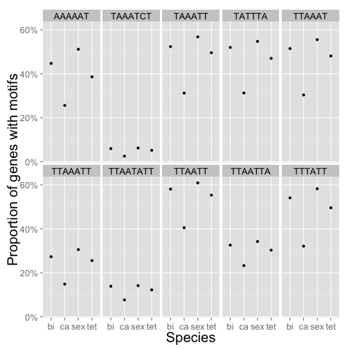
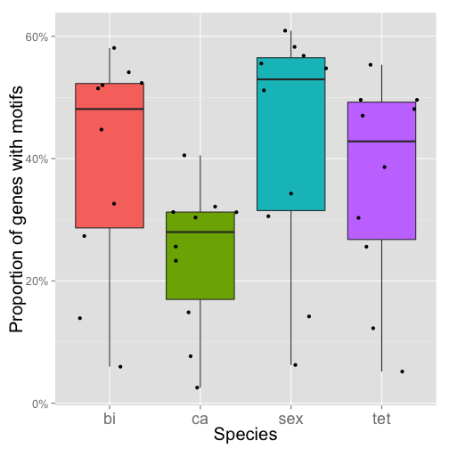

# Correlate distance with motifs #

Loop trough all the files and analyze the results.

First step: loading data

```r
setwd("~/Documents/ENS/M1/Stage/para/results/analysis/")

extraction <- function(patt) {
    extract <- dir("../motifs_extraction", full.names = TRUE, pattern = patt)
    extract <- extract[2:length(extract)]
}

# Load files of genes for each motifs of each species
extract_bi <- extraction("bi.res$")
extract_ca <- extraction("ca.res$")
extract_sex <- extraction("sex.res$")
extract_tet <- extraction("tet.res$")

# Load expression data
exp_bi = read.table("../../data/biaurelia_RNAseq_xp.tab", h = T)
exp_ca = read.table("../../data/caudatum_RNAseq_xp.tab", h = T)
exp_sex = read.table("../../data/sexaurelia_RNAseq_xp.tab", h = T)
exp_tet = read.table("../../data/tetraurelia_RNAseq_xp.tab", h = T)

# Load motifs name <-> motif correspondance table
motifs = read.table("../15may14consensuscomp.txt", sep = "\t")
head(motifs)
```

```
##             V1     V2 V3      V4 V5         V6 V7      V8
## 1 WGD2ANC00043 motif1  6 Motif 1 38 PBIGNG2963  1  TTTATT
## 2 WGD2ANC00047 motif1  7 Motif 1 50 PBIGNG2688  1 TATAATT
## 3 WGD2ANC00051 motif1  7 Motif 1 50 PBIGNG3029  1 TTAAATT
## 4 WGD2ANC00051 motif2  6 Motif 1 50 PBIGNG3029  1  TTAAAT
## 5 WGD2ANC00055 motif1  7 Motif 1 29 PBIGNG3029  1 ATACTAA
## 6 WGD2ANC00070 motif1  6 Motif 1 41 PBIGNG3030  1  TAAATT
```

```r
colnames(motifs) = c("family", "BF.motif", "BF.size", "MEME.motif", "MEME.size", 
    "gene", "match.ratio", "consensus")

# pvalue threshold to select in the whole file
pval.thre = 0.01
```


Function to treat each files from each list

```r
# Function to use on every file, returns a table of matching genes between
# expression and extracted data
corr.dist.exp <- function(extract_file, expression_file) {
    extract_table = read.table(extract_file, h = F)
    colnames(extract_table) = c("gene_id", "distance", "motifs.number")
    extract_match = extract_table[match(expression_file$gene_id, extract_table$gene_id, 
        nomatch = 0), ]
    extract.merge = merge(extract_match, expression_file)
}

# Function to returns p.value of fitted models
lm.pvalue <- function(table.merged) {
    model = lm(xp ~ distance, data = table.merged)  # Produce a linear model for data
    p.value = summary(model)$coefficients[[8]]
    rsq = summary(model)$adj.r.squared
    list(p.value, rsq)
}
```


Test on *Paramecium biaurelia*, see the number of signifisexnt correlations.


```r
bi.pvalues = rep(NA, length(extract_bi))
bi.rsq = rep(NA, length(extract_bi))

for (i in 1:length(extract_bi)) {
    merged = corr.dist.exp(extract_bi[i], exp_bi)
    
    if (length(merged[, 1]) > 2) {
        mod = lm.pvalue(merged)
        p.value = mod[[1]][1]
        rsq = mod[[2]][1]
        bi.pvalues[i] = p.value
        bi.rsq[i] = rsq
    }
}
length(bi.pvalues)
```

```
## [1] 103
```

```r
summary(bi.pvalues)
```

```
##    Min. 1st Qu.  Median    Mean 3rd Qu.    Max.    NA's 
##   0.000   0.000   0.116   0.279   0.532   0.991      10
```

```r
length(subset(bi.pvalues, bi.pvalues < pval.thre))
```

```
## [1] 33
```


For *P. caudatum*


```r
ca.pvalues = rep(NA, length(extract_ca))
ca.rsq = rep(NA, length(extract_ca))

for (i in 1:length(extract_ca)) {
    merged = corr.dist.exp(extract_ca[i], exp_ca)
    
    if (length(merged[, 1]) > 2) {
        mod = lm.pvalue(merged)
        p.value = mod[[1]][1]
        rsq = mod[[2]][1]
        ca.pvalues[i] = p.value
        ca.rsq[i] = rsq
    }
}
length(ca.pvalues)
```

```
## [1] 95
```

```r
summary(ca.pvalues)
```

```
##    Min. 1st Qu.  Median    Mean 3rd Qu.    Max.    NA's 
##   0.000   0.000   0.058   0.258   0.416   0.989       7
```

```r
length(subset(ca.pvalues, ca.pvalues < pval.thre))
```

```
## [1] 36
```


For *P. sexaurelia*


```r
sex.pvalues = rep(NA, length(extract_sex))
sex.rsq = rep(NA, length(extract_sex))

for (i in 1:length(extract_sex)) {
    merged = corr.dist.exp(extract_sex[i], exp_sex)
    
    if (length(merged[, 1]) > 2) {
        mod = lm.pvalue(merged)
        p.value = mod[[1]][1]
        rsq = mod[[2]][1]
        sex.pvalues[i] = p.value
        sex.rsq[i] = rsq
    }
}
length(sex.pvalues)
```

```
## [1] 99
```

```r
summary(sex.pvalues)
```

```
##    Min. 1st Qu.  Median    Mean 3rd Qu.    Max.    NA's 
##   0.000   0.000   0.029   0.218   0.357   0.995       5
```

```r
length(subset(sex.pvalues, sex.pvalues < pval.thre))
```

```
## [1] 44
```


For *P. tetraurelia*

```r
tet.pvalues = rep(NA, length(extract_tet))
tet.rsq = rep(NA, length(extract_tet))

for (i in 1:length(extract_tet)) {
    merged = corr.dist.exp(extract_tet[i], exp_tet)
    
    if (length(merged[, 1]) > 2) {
        mod = lm.pvalue(merged)
        p.value = mod[[1]][1]
        rsq = mod[[2]][1]
        tet.pvalues[i] = p.value
        tet.rsq[i] = rsq
    }
}
length(tet.pvalues)
```

```
## [1] 99
```

```r
summary(tet.pvalues)
```

```
##    Min. 1st Qu.  Median    Mean 3rd Qu.    Max.    NA's 
##   0.000   0.000   0.076   0.240   0.446   0.952       6
```

```r
length(subset(tet.pvalues, tet.pvalues < pval.thre))
```

```
## [1] 42
```


Let see if there are some motifs in common.

```r

# To have indexes of elements
bi.match = match(subset(bi.pvalues, bi.pvalues < pval.thre), bi.pvalues)
ca.match = match(subset(ca.pvalues, ca.pvalues < pval.thre), ca.pvalues)
sex.match = match(subset(sex.pvalues, sex.pvalues < pval.thre), sex.pvalues)
tet.match = match(subset(tet.pvalues, tet.pvalues < pval.thre), tet.pvalues)

# Common elements
common = intersect(intersect(intersect(bi.match, ca.match), sex.match), tet.match)
length(common)
```

```
## [1] 10
```


Let's extract the sequence of conserved motifs

```r
common.motifs = data.frame()
for (i in 1:length(common)) {
    index = common[i]
    filename = extract_bi[index]
    print(filename)
    filename = strsplit(filename, "/")
    filename = filename[[1]][3]
    fam = substr(filename, 1, 12)
    fam.motif = substr(filename, 13, 18)
    common.motifs = rbind(common.motifs, subset(motifs, family == fam & BF.motif == 
        fam.motif))
}
```

```
## [1] "../motifs_extraction/WGD2ANC00043motif1bi.res"
## [1] "../motifs_extraction/WGD2ANC00051motif1bi.res"
## [1] "../motifs_extraction/WGD2ANC00051motif2bi.res"
## [1] "../motifs_extraction/WGD2ANC00070motif1bi.res"
## [1] "../motifs_extraction/WGD2ANC00130motif2bi.res"
## [1] "../motifs_extraction/WGD2ANC00306motif1bi.res"
## [1] "../motifs_extraction/WGD2ANC00949motif1bi.res"
## [1] "../motifs_extraction/WGD2ANC01015motif1bi.res"
## [1] "../motifs_extraction/WGD2ANC01171motif2bi.res"
## [1] "../motifs_extraction/WGD2ANC01368motif1bi.res"
```

```r
common.motifs
```

```
##          family BF.motif BF.size MEME.motif MEME.size       gene
## 1  WGD2ANC00043   motif1       6    Motif 1        38 PBIGNG2963
## 3  WGD2ANC00051   motif1       7    Motif 1        50 PBIGNG3029
## 4  WGD2ANC00051   motif2       6    Motif 1        50 PBIGNG3029
## 6  WGD2ANC00070   motif1       6    Motif 1        41 PBIGNG3030
## 8  WGD2ANC00130   motif2       7    Motif 1        48 PBIGNG0393
## 16 WGD2ANC00306   motif1       6    Motif 1        41 PBIGNG0695
## 26 WGD2ANC00949   motif1       7    Motif 1        25 PBIGNG0857
## 30 WGD2ANC01015   motif1       6    Motif 1        35 PBIGNG1824
## 34 WGD2ANC01171   motif2       6    Motif 1        40 PBIGNG0243
## 41 WGD2ANC01368   motif1       8    Motif 2        29 PBIGNG1307
##    match.ratio consensus
## 1            1    TTTATT
## 3            1   TTAAATT
## 4            1    TTAAAT
## 6            1    TAAATT
## 8            1   TAAATCT
## 16           1    TTAATT
## 26           1   TTAATTA
## 30           1    TATTTA
## 34           1    AAAAAT
## 41           1  TTAATATT
```


Look at the scatterplots

```r
library(ggplot2)
for (i in 1:length(common)) {
    merged = corr.dist.exp(extract_bi[common[i]], exp_bi)
    index = common[i]
    filename = extract_bi[index]
    filename = strsplit(filename, "/")
    filename = filename[[1]][3]
    fam = substr(filename, 1, 12)
    fam.motif = substr(filename, 13, 18)
    mot = subset(common.motifs, family == fam & BF.motif == fam.motif)$consensus
    print(ggplot(merged, aes(x = distance, y = xp)) + geom_point(alpha = 0.5, 
        position = "jitter") + labs(x = "Distance from Start Codon", y = "Gene Expression", 
        title = paste("Distance - Expression for", mot)))
}
```

          


If we try to classify motifs as associated with high or low expression among species?
The idea is two try to see if genes with given motif are higher or lower expressed than genes without.


```r
# Function to classify motifs as increaser or decreaser of gene expression
expression.modifier <- function(extract_file, exp_file) {
    extract_table = read.table(extract_file, h = F)  # Extract file
    colnames(extract_table) = c("gene_id", "distance", "motifs.number")
    # Expression of genes that contain the motif
    extract_match = exp_file[match(extract_table$gene_id, exp_file$gene_id, 
        nomatch = 0), ]
    # Expression of genes without the motif
    extract_no = exp_file[!match(exp_file$gene_id, extract_table$gene_id, nomatch = 0), 
        ]
    # Compare if the means, null hypothesis: means are equal (better than t-test
    # besexuse non-normal distribution)
    w.test = wilcox.test(extract_match$xp, extract_no$xp)
    if (w.test$p.value < pval.thre) {
        
        # If genes with motif are more expressed, the motif is increasing expression
        if (mean(extract_match$xp > mean(extract_no$xp))) {
            classifier = "high"
        } else {
            classifier = "low"
        }
    } else {
        classifier = NA
    }
    list(mod = classifier, match = length(extract_match[, 1]), nomatch = length(extract_no[, 
        1]), avg.dist = mean(extract_table$distance))
}
```


```r
bi.classify = data.frame()

for (i in 1:length(extract_bi)) {
    filename = extract_bi[i]
    filename = strsplit(filename, "/")
    filename = filename[[1]][3]
    fam = substr(filename, 1, 12)
    fam.motif = substr(filename, 13, 18)
    
    modifier = expression.modifier(extract_bi[i], exp_bi)
    motif_data = subset(motifs, family == fam & BF.motif == fam.motif)
    bi.classify = rbind(bi.classify, cbind(motif_data, as.factor(modifier$mod), 
        modifier$match, modifier$nomatch, modifier$avg.dist))
    
}
colnames(bi.classify)[9:11] = c("modifier", "bi.match", "bi.nomatch")
```


```r
ca.classify = data.frame()

for (i in 1:length(extract_ca)) {
    filename = extract_ca[i]
    filename = strsplit(filename, "/")
    filename = filename[[1]][3]
    fam = substr(filename, 1, 12)
    fam.motif = substr(filename, 13, 18)
    
    modifier = expression.modifier(extract_ca[i], exp_ca)
    motif_data = subset(motifs, family == fam & BF.motif == fam.motif)
    ca.classify = rbind(ca.classify, cbind(motif_data, as.factor(modifier$mod), 
        modifier$match, modifier$nomatch))
    
}
colnames(ca.classify)[9:11] = c("modifier", "ca.match", "ca.nomatch")
```


```r
sex.classify = data.frame()

for (i in 1:length(extract_sex)) {
    filename = extract_sex[i]
    filename = strsplit(filename, "/")
    filename = filename[[1]][3]
    fam = substr(filename, 1, 12)
    fam.motif = substr(filename, 13, 18)
    
    modifier = expression.modifier(extract_sex[i], exp_sex)
    motif_data = subset(motifs, family == fam & BF.motif == fam.motif)
    sex.classify = rbind(sex.classify, cbind(motif_data, as.factor(modifier$mod), 
        modifier$match, modifier$nomatch))
    
}
colnames(sex.classify)[9:11] = c("modifier", "sex.match", "sex.nomatch")
```


```r
tet.classify = data.frame()

for (i in 1:length(extract_tet)) {
    filename = extract_tet[i]
    filename = strsplit(filename, "/")
    filename = filename[[1]][3]
    fam = substr(filename, 1, 12)
    fam.motif = substr(filename, 13, 18)
    
    modifier = expression.modifier(extract_tet[i], exp_tet)
    motif_data = subset(motifs, family == fam & BF.motif == fam.motif)
    tet.classify = rbind(tet.classify, cbind(motif_data, as.factor(modifier$mod), 
        modifier$match, modifier$nomatch))
    
}
colnames(tet.classify)[9:11] = c("modifier", "tet.match", "tet.nomatch")
```


Let's look at coregulation patterns in all the species


```r
library(scales)
common.regulation = cbind(bi.classify[common, 8:11], ca.classify[common, 9:11], 
    sex.classify[common, 9:11], tet.classify[common, 9:11])
colnames(common.regulation)[c(2, 5, 8, 11)] = c("bi.mod", "ca.mod", "sex.mod", 
    "tet.mod")
common.regulation
```

```
##    consensus bi.mod bi.match bi.nomatch ca.mod ca.match ca.nomatch sex.mod
## 1     TTTATT   high    21238      18004   <NA>     5949      12560    <NA>
## 3    TTAAATT   high    10727      28515   <NA>     2750      15759    high
## 4     TTAAAT   high    20199      19043   high     5619      12890    <NA>
## 6     TAAATT   high    20549      18693   <NA>     5780      12729    <NA>
## 8    TAAATCT   high     2341      36901   high      471      18038    <NA>
## 16    TTAATT   high    22797      16445   <NA>     7501      11008    <NA>
## 26   TTAATTA   high    12802      26440   high     4311      14198    high
## 30    TATTTA   high    20406      18836   <NA>     5786      12723    <NA>
## 34    AAAAAT   <NA>    17555      21687   <NA>     4739      13770    <NA>
## 41  TTAATATT   high     5452      33790   <NA>     1421      17088    <NA>
##    sex.match sex.nomatch tet.mod tet.match tet.nomatch
## 1      20357       14582    high     20344       20666
## 3      10680       24259    high     10493       30517
## 4      19407       15532    <NA>     19728       21282
## 6      19849       15090    high     20340       20670
## 8       2184       32755    <NA>      2124       38886
## 16     21282       13657    <NA>     22693       18317
## 26     11975       22964    high     12427       28583
## 30     19131       15808    high     19283       21727
## 34     17872       17067    high     15833       25177
## 41      4956       29983    <NA>      5026       35984
```

```r
library(reshape2)
common.melt = melt(common.regulation)[, c(1, 6, 7)]
```

```
## Using consensus, bi.mod, ca.mod, sex.mod, tet.mod as id variables
```

```r
common.tot = melt(common.regulation)
```

```
## Using consensus, bi.mod, ca.mod, sex.mod, tet.mod as id variables
```

```r
com = cbind(common.melt, colsplit(common.melt$variable, names = c("species", 
    "type"), pattern = "\\."))
common.cast = dcast(com, consensus + species ~ type)

common.tot = cbind(common.tot, colsplit(common.tot$variable, names = c("species", 
    "type"), pattern = "\\."))
tot.cast = dcast(common.tot, consensus + bi.mod + ca.mod + sex.mod + tet.mod ~ 
    type + species)

c = cbind(common.cast, common.cast$match/(common.cast$match + common.cast$nomatch))
colnames(c)[5] = "ratio"

reduced = dcast(melt(c), consensus ~ species + variable)[, c(1, 2, 4, 5, 7, 
    8, 10, 11, 13)]
```

```
## Using consensus, species as id variables
```

```r
reduced = cbind(reduced, tot.cast$bi.mod, tot.cast$ca.mod, tot.cast$sex.mod, 
    tot.cast$tet.mod)
colnames(reduced)[10:13] = c("bi_mod", "ca_mod", "sex_mod", "tet_mod")
reduced[, c(3, 5, 7, 9)] = round(reduced[, c(3, 5, 7, 9)] * 100, 2)

# Each motif separated
ggplot(c, aes(x = species, y = ratio)) + geom_point() + labs(x = "Species", 
    y = "Proportion of genes with motifs") + facet_wrap(~consensus, ncol = 5) + 
    scale_y_continuous(labels = percent) + theme(text = element_text(size = rel(4.5)))
```

 

```r

# All motifs by species
ggplot(c, aes(x = species, y = ratio, fill = species)) + geom_boxplot() + geom_jitter() + 
    labs(x = "Species", y = "Proportion of genes with motifs") + scale_fill_discrete(labels = c("P. biaurelia", 
    "P. caudatum", "P. sexaurelia", "P. tetraurelia")) + scale_y_continuous(labels = percent) + 
    theme(text = element_text(size = rel(4.5)), axis.text.x = element_text(size = rel(5)), 
        legend.position = "none")
```

 

```r

# Group Motifs
ggplot(c, aes(x = consensus, y = ratio)) + geom_boxplot() + geom_jitter() + 
    labs(x = "Motifs", y = "Proportion of genes with motifs") + scale_y_continuous(labels = percent) + 
    theme(legend.position = "none", text = element_text(size = rel(4.5)), axis.text.x = element_text(size = rel(4.5)))
```

 

```r

for (i in 1:length(unique(common.cast$consensus))) {
    glm = glm(cbind(match, nomatch) ~ species * consensus, family = binomial, 
        common.cast[common.cast, ])
    Anova(glm)
}
```

```
## Error: type 'list' d'indice incorrect
```

