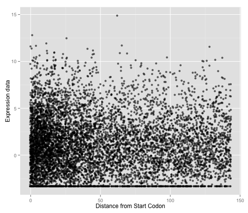
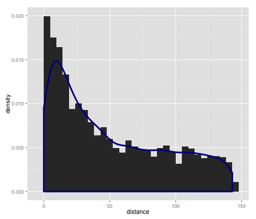
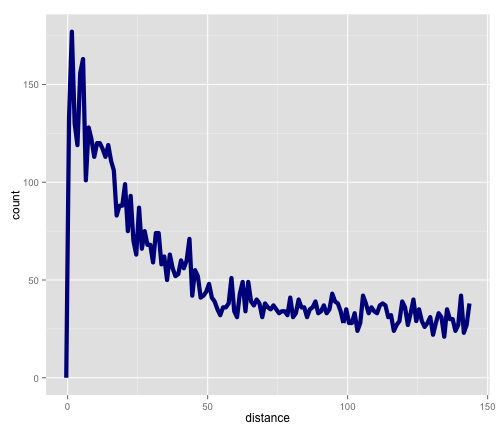

# Extraction motifs #

Extracted motifs from Paramecium biaurelia, on motif "TAAATTT" from the 150 first nucleotides

```r
# Load genome extract
extract.genes = read.table("../extract_test//biTAAATTT13may14genes.res", h = F)
head(extract.genes)
```

```
##            V1  V2 V3
## 1 PBIGNG00013  64  1
## 2 PBIGNG00014   1  1
## 3 PBIGNG00024  67  1
## 4 PBIGNG00031  13  1
## 5 PBIGNG00032  12  1
## 6 PBIGNG00034 119  1
```

```r
colnames(extract.genes) = c("gene_id", "distance", "motifs.number")
summary(extract.genes)
```

```
##         gene_id        distance     motifs.number 
##  PBIGNG00013:   1   Min.   :  0.0   Min.   :1.00  
##  PBIGNG00014:   1   1st Qu.: 14.0   1st Qu.:1.00  
##  PBIGNG00024:   1   Median : 39.0   Median :1.00  
##  PBIGNG00031:   1   Mean   : 51.3   Mean   :1.11  
##  PBIGNG00032:   1   3rd Qu.: 85.0   3rd Qu.:1.00  
##  PBIGNG00034:   1   Max.   :143.0   Max.   :4.00  
##  (Other)    :7507
```

```r

# Load expression data
bi.exp = read.table("../../data/biaurelia_RNAseq_xp.tab", h = T)
head(bi.exp)
```

```
##       gene_id      xp
## 1 PBIGNG00001  0.2589
## 2 PBIGNG00002  0.4204
## 3 PBIGNG00003 -2.4828
## 4 PBIGNG00004 -3.3219
## 5 PBIGNG00005 -0.6067
## 6 PBIGNG00006  0.6050
```

```r

length(intersect(bi.exp$gene_id, extract.genes$gene_id))
```

```
## [1] 7513
```


7513 hits -> all genes in extract.genes are in bi.exp


```r

# Match the two data
bi.match = extract.genes[match(bi.exp$gene_id, extract.genes$gene_id, nomatch = 0), 
    ]
bi.merge = merge(bi.match, bi.exp)
```


Now that the data is merged. Let's look at the data


```r
library(ggplot2)

g = ggplot(bi.merge, aes(x = distance, y = xp))
g + geom_point(alpha = 0.6, position = "jitter") + labs(x = "Distance from Start Codon", 
    y = "Expression data", main = "Paramecium biaurelia TAAATTT motif")
```

 

```r

d = ggplot(bi.merge, aes(x = distance))
d + geom_histogram(aes(y = ..density..)) + geom_density(size = 1.5, colour = "darkblue")
```

```
## stat_bin: binwidth defaulted to range/30. Use 'binwidth = x' to adjust this.
```

 

```r
d + geom_freqpoly(size = 2, colour = "darkblue", binwidth = 1)
```

 

```r
lin = lm(xp ~ distance, data = bi.merge)
summary(lin)
```

```
## 
## Call:
## lm(formula = xp ~ distance, data = bi.merge)
## 
## Residuals:
##    Min     1Q Median     3Q    Max 
## -4.700 -2.253 -0.299  1.833 13.687 
## 
## Coefficients:
##              Estimate Std. Error t value Pr(>|t|)    
## (Intercept)  1.377891   0.054511   25.28  < 2e-16 ***
## distance    -0.002922   0.000819   -3.57  0.00036 ***
## ---
## Signif. codes:  0 '***' 0.001 '**' 0.01 '*' 0.05 '.' 0.1 ' ' 1
## 
## Residual standard error: 3.01 on 7511 degrees of freedom
## Multiple R-squared:  0.00169,	Adjusted R-squared:  0.00156 
## F-statistic: 12.7 on 1 and 7511 DF,  p-value: 0.000363
```


Very significant negative correlation between distance and expression (P = 0.0003)
