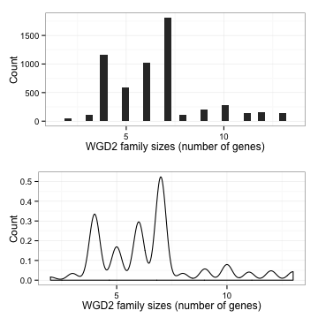

Analysis of WGD2 families
=========================

Loading and general view of WGD2 families


```r
setwd("../")
families = read.csv("family_WGD2_sizes.csv", sep = "\t")
head(families)
```

```
##           name size
## 1 WGD2ANC00001    6
## 2 WGD2ANC00002   13
## 3 WGD2ANC00003    7
## 4 WGD2ANC00004   10
## 5 WGD2ANC00005    7
## 6 WGD2ANC00006    4
```

```r
summary(families)
```

```
##            name           size      
##  WGD2ANC00001:   1   Min.   : 2.00  
##  WGD2ANC00002:   1   1st Qu.: 5.00  
##  WGD2ANC00003:   1   Median : 6.00  
##  WGD2ANC00004:   1   Mean   : 6.52  
##  WGD2ANC00005:   1   3rd Qu.: 7.00  
##  WGD2ANC00006:   1   Max.   :13.00  
##  (Other)     :5775
```


What does the distribution looks like


```r
library(ggplot2)
source("multiplot.R")
gg = ggplot(families, aes(x = size))
p1 = gg + geom_histogram() + theme_bw() + labs(x = "WGD2 family sizes (number of genes)", 
    y = "Count")
p2 = gg + geom_density() + theme_bw() + labs(x = "WGD2 family sizes (number of genes)", 
    y = "Count")
multiplot(p1, p2)
```

```
## Loading required package: grid
## stat_bin: binwidth defaulted to range/30. Use 'binwidth = x' to adjust this.
```

 


What value use? Try looking at various percentiles

```r
sizes = families$size
quantile(sizes, c(0.25, 0.1, 0.05, 0.01, 0.001))
```

```
##  25%  10%   5%   1% 0.1% 
##    5    4    4    3    2
```


