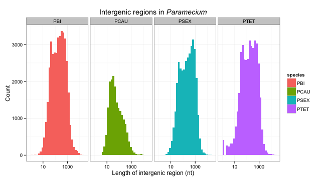

Analysis of intergenic region length
========================================================

Loading data:

```r
setwd("../")
intergene = read.csv("upstream_lengths.csv", sep = "\t")
head(intergene)
```

```
##   species length         name
## 1    PSEX  17669 PSEXGNG34859
## 2    PSEX  17730 PSEXGNG34860
## 3    PSEX    935 PSEXGNG34852
## 4    PSEX   6492 PSEXGNG34853
## 5    PSEX     58 PSEXGNG34854
## 6    PSEX    245 PSEXGNG34855
```

```r
summary(intergene)
```

```
##  species          length                name       
##  PBI :39242   Min.   :-15406   PBIGNG00001:     1  
##  PCAU:18509   1st Qu.:    37   PBIGNG00002:     1  
##  PSEX:34939   Median :   137   PBIGNG00003:     1  
##  PTET:41010   Mean   :   352   PBIGNG00004:     1  
##               3rd Qu.:   445   PBIGNG00005:     1  
##               Max.   : 17730   PBIGNG00006:     1  
##                                (Other)    :133694
```

**Problem**: we have some negative values!

How many? What species?


```r
neg = subset(intergene, length < 0)
summary(neg)
```

```
##  species         length                  name     
##  PBI :   0   Min.   :-15406   PTETEGNG00019:   1  
##  PCAU:   0   1st Qu.:   -40   PTETEGNG00056:   1  
##  PSEX:   0   Median :   -22   PTETEGNG00057:   1  
##  PTET:3519   Mean   :   -41   PTETEGNG00060:   1  
##              3rd Qu.:    -9   PTETEGNG00073:   1  
##              Max.   :    -1   PTETEGNG00077:   1  
##                               (Other)      :3513
```


All negative values are from *P. tetraurelia*.

New computation of intergenic distances using JF's scripts.

```r
setwd("../")
dist = read.csv("intergenic.csv", sep = " ", h = F)
head(dist)
```

```
##            V1  V2  V3
## 1 PBIGNT36862 219 PBI
## 2 PBIGNT36863 142 PBI
## 3 PBIGNT36864  81 PBI
## 4 PBIGNT36865 127 PBI
## 5 PBIGNT36866  13 PBI
## 6 PBIGNT36867 965 PBI
```

```r
colnames(dist) = c("gene", "length", "species")
```


Showing intergenic regions:


```r
library(ggplot2)
gg = ggplot(dist, aes(x = length, fill = species))
p = gg + geom_histogram() + scale_x_log10() + facet_grid(. ~ species) + theme_bw() + 
    labs(x = "Length of intergenic region (nt)", y = "Count", title = expression(paste("Intergenic regions in ", 
        italic("Paramecium"))))
p
```

```
## stat_bin: binwidth defaulted to range/30. Use 'binwidth = x' to adjust this.
## stat_bin: binwidth defaulted to range/30. Use 'binwidth = x' to adjust this.
## stat_bin: binwidth defaulted to range/30. Use 'binwidth = x' to adjust this.
## stat_bin: binwidth defaulted to range/30. Use 'binwidth = x' to adjust this.
```

 


What value use? Try looking at various percentiles

```r
quantile(dist$length, c(0.1, 0.05, 0.01, 0.001))
```

```
##  10%   5%   1% 0.1% 
##   23   15    5    1
```


We should select the 95th percentile
