Motifs found by April 30th analysis
========================================================

Simple code to see what motifs were found.


```r
motifs = read.csv("../motifsscores.txt", sep = "\t", h = T)
head(motifs)
```

```
##         family distance size phyloscore alignscore
## 1 WGD2ANC00031       69   19     0.6132     0.5842
## 2 WGD2ANC00031      275   16     0.5906     0.8469
## 3 WGD2ANC00182       36   21     0.8429     0.9667
## 4 WGD2ANC00182       73   10     0.5100     0.7300
## 5 WGD2ANC00182      102   11     0.6227     0.5909
## 6 WGD2ANC00182      114    9     0.8389     1.0000
```


How many motifs are there? What distribution? What families are represented?


```r
library(ggplot2)
library(scales)
g = ggplot(motifs, aes(x = size))
g + geom_histogram(aes(y = ..density..), fill = "darkgreen") + geom_density() + 
    labs(x = "Motif Size", y = "Density") + scale_y_continuous(labels = percent)
```

```
## stat_bin: binwidth defaulted to range/30. Use 'binwidth = x' to adjust this.
```

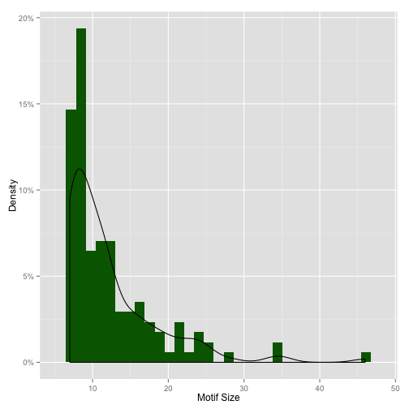 

```r
g + geom_histogram(fill = "darkblue") + labs(x = "Motif Size", y = "Counts")
```

```
## stat_bin: binwidth defaulted to range/30. Use 'binwidth = x' to adjust this.
```

 


```r
library(reshape)
cast(motifs, formula = ~family, fun.aggregate = mean)
```

```
## Using alignscore as value column.  Use the value argument to cast to override this choice
```

```
##   value WGD2ANC00031 WGD2ANC00182 WGD2ANC00311 WGD2ANC00387 WGD2ANC00451
## 1 (all)       0.7155       0.8219       0.7722            1       0.7479
##   WGD2ANC00488 WGD2ANC00492 WGD2ANC00505 WGD2ANC00530 WGD2ANC00581
## 1            1       0.7079        0.815       0.5958       0.9929
##   WGD2ANC00630 WGD2ANC00651 WGD2ANC00656 WGD2ANC00687 WGD2ANC00726
## 1       0.9389       0.7343       0.9531         0.75            1
##   WGD2ANC00907 WGD2ANC00928 WGD2ANC00949 WGD2ANC00958 WGD2ANC01001
## 1       0.8857       0.9625       0.4528       0.9187            1
##   WGD2ANC01066 WGD2ANC01102 WGD2ANC01294 WGD2ANC01412 WGD2ANC01495
## 1       0.7109       0.8542       0.5941       0.5062            1
##   WGD2ANC01530 WGD2ANC01532 WGD2ANC01563 WGD2ANC01568 WGD2ANC01574
## 1       0.8194       0.5708       0.5417       0.7773       0.3375
##   WGD2ANC01595 WGD2ANC01669 WGD2ANC01715 WGD2ANC01761 WGD2ANC01792
## 1          0.8       0.9571       0.9711       0.9437       0.2857
##   WGD2ANC01916 WGD2ANC01925 WGD2ANC01930 WGD2ANC01993 WGD2ANC02135
## 1       0.9045       0.8683            1       0.9215       0.9688
##   WGD2ANC02164 WGD2ANC02226 WGD2ANC02362 WGD2ANC02383 WGD2ANC02424
## 1       0.7933       0.9708         0.95       0.4272          0.8
##   WGD2ANC02466 WGD2ANC02555 WGD2ANC02636 WGD2ANC02697 WGD2ANC02721
## 1       0.5385       0.9883            1       0.9528       0.3333
##   WGD2ANC02833 WGD2ANC02862 WGD2ANC02942 WGD2ANC02960 WGD2ANC03003
## 1       0.3636       0.6937       0.5476        0.665       0.5786
##   WGD2ANC03049 WGD2ANC03059 WGD2ANC03088 WGD2ANC03116 WGD2ANC03129
## 1       0.3667          0.2       0.8853       0.3944       0.9375
##   WGD2ANC03139 WGD2ANC03145 WGD2ANC03316 WGD2ANC03407 WGD2ANC03436
## 1            1       0.7214       0.9714        0.925            1
##   WGD2ANC03453 WGD2ANC03483 WGD2ANC03603 WGD2ANC03636 WGD2ANC03671
## 1          0.7       0.8923         0.85       0.6767       0.9625
##   WGD2ANC03690 WGD2ANC03694 WGD2ANC03699 WGD2ANC03869 WGD2ANC03965
## 1       0.9357       0.9767       0.9643         0.55       0.8227
##   WGD2ANC04128 WGD2ANC04174 WGD2ANC04187 WGD2ANC04245 WGD2ANC04264
## 1       0.8786            1          0.7         0.95        0.815
##   WGD2ANC04356 WGD2ANC04473 WGD2ANC04677 WGD2ANC04783 WGD2ANC04815
## 1       0.7967       0.8969            1        0.755       0.8562
##   WGD2ANC04917 WGD2ANC04935 WGD2ANC04946 WGD2ANC04989 WGD2ANC05162
## 1       0.4667       0.9462         0.35        0.975       0.9143
##   WGD2ANC05188 WGD2ANC05217 WGD2ANC05243 WGD2ANC05283 WGD2ANC05287
## 1       0.7575       0.5167       0.8063       0.9357         0.55
##   WGD2ANC05311 WGD2ANC05446 WGD2ANC05453 WGD2ANC05475 WGD2ANC05510
## 1       0.6188       0.8429         0.45       0.8125       0.7925
##   WGD2ANC05562 WGD2ANC05614 WGD2ANC05654 WGD2ANC05655 WGD2ANC05657
## 1       0.9818       0.8731       0.9273       0.3091            1
##   WGD2ANC05674 WGD2ANC05718 WGD2ANC05721
## 1       0.2227       0.3214       0.9906
```

```r
quantile(motifs$size, c(0.05, 0.1, 0.25, 0.5, 0.75, 0.9, 0.95))
```

```
##   5%  10%  25%  50%  75%  90%  95% 
##  7.0  7.0  8.0 10.0 14.5 21.0 24.0
```

```r
summary(motifs)
```

```
##           family       distance          size        phyloscore   
##  WGD2ANC04473:  5   Min.   :  2.0   Min.   : 7.0   Min.   :0.318  
##  WGD2ANC00182:  4   1st Qu.: 18.5   1st Qu.: 8.0   1st Qu.:0.621  
##  WGD2ANC03088:  3   Median : 44.0   Median :10.0   Median :0.750  
##  WGD2ANC00031:  2   Mean   : 71.2   Mean   :12.2   Mean   :0.716  
##  WGD2ANC00505:  2   3rd Qu.: 82.5   3rd Qu.:14.5   3rd Qu.:0.832  
##  WGD2ANC01294:  2   Max.   :498.0   Max.   :46.0   Max.   :0.968  
##  (Other)     :113                                                 
##    alignscore   
##  Min.   :0.150  
##  1st Qu.:0.632  
##  Median :0.850  
##  Mean   :0.778  
##  3rd Qu.:0.964  
##  Max.   :1.000  
## 
```

```r

# Show the two families with maximum occurrences

motifs[motifs$family == "WGD2ANC04473", ]
```

```
##           family distance size phyloscore alignscore
## 96  WGD2ANC04473       24   22     0.6955     1.0000
## 97  WGD2ANC04473       65    8     0.4813     0.9688
## 98  WGD2ANC04473       81   13     0.9038     0.9500
## 99  WGD2ANC04473       98   25     0.8080     0.6300
## 100 WGD2ANC04473      125    7     0.8143     0.9357
```

```r
motifs[motifs$family == "WGD2ANC00182", ]
```

```
##         family distance size phyloscore alignscore
## 3 WGD2ANC00182       36   21     0.8429     0.9667
## 4 WGD2ANC00182       73   10     0.5100     0.7300
## 5 WGD2ANC00182      102   11     0.6227     0.5909
## 6 WGD2ANC00182      114    9     0.8389     1.0000
```

```r


# Show maximum and minimum
motifs[motifs$size == max(motifs$size), ]
```

```
##          family distance size phyloscore alignscore
## 52 WGD2ANC02383       18   46     0.7826     0.4272
```

```r
motifs[motifs$size == min(motifs$size), ]
```

```
##           family distance size phyloscore alignscore
## 8   WGD2ANC00387      227    7     0.7000     1.0000
## 15  WGD2ANC00581       92    7     0.8357     0.9929
## 21  WGD2ANC00907       40    7     0.7357     0.8857
## 38  WGD2ANC01669      448    7     0.6000     0.9571
## 41  WGD2ANC01792       27    7     0.4143     0.2857
## 44  WGD2ANC01925      246    7     0.8071     0.9643
## 56  WGD2ANC02555       76    7     0.8214     0.9857
## 64  WGD2ANC03003       47    7     0.5857     0.5786
## 68  WGD2ANC03088        9    7     0.8143     0.8500
## 74  WGD2ANC03145       34    7     0.7786     0.7214
## 75  WGD2ANC03316       12    7     0.8286     0.9714
## 82  WGD2ANC03636       44    7     0.7571     0.7000
## 85  WGD2ANC03690      337    7     0.5500     0.9357
## 87  WGD2ANC03699       32    7     0.6643     0.9643
## 88  WGD2ANC03869      112    7     0.3429     0.5500
## 90  WGD2ANC04128      251    7     0.4857     0.8786
## 100 WGD2ANC04473      125    7     0.8143     0.9357
## 101 WGD2ANC04677       57    7     0.7643     1.0000
## 106 WGD2ANC04946       20    7     0.7357     0.3500
## 108 WGD2ANC05162       19    7     0.8071     0.9143
## 113 WGD2ANC05283       10    7     0.7714     0.9357
## 116 WGD2ANC05446       43    7     0.6143     0.8429
## 118 WGD2ANC05453       14    7     0.5571     0.5500
## 129 WGD2ANC05718      149    7     0.5571     0.3214
## 130 WGD2ANC05721       81    7     0.7071     1.0000
```


What about the distribution of distance?


```r
g = ggplot(motifs, aes(x = distance))
g + geom_histogram(fill = "darkblue")
```

```
## stat_bin: binwidth defaulted to range/30. Use 'binwidth = x' to adjust this.
```

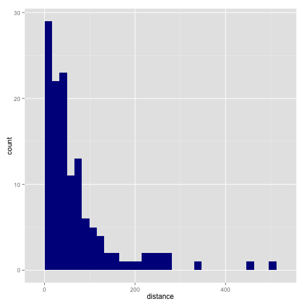 

```r
g + geom_histogram(aes(y = ..density..), fill = "darkblue") + geom_density() + 
    labs(x = "Distance", y = "Density") + scale_y_continuous(labels = percent)
```

```
## stat_bin: binwidth defaulted to range/30. Use 'binwidth = x' to adjust this.
```

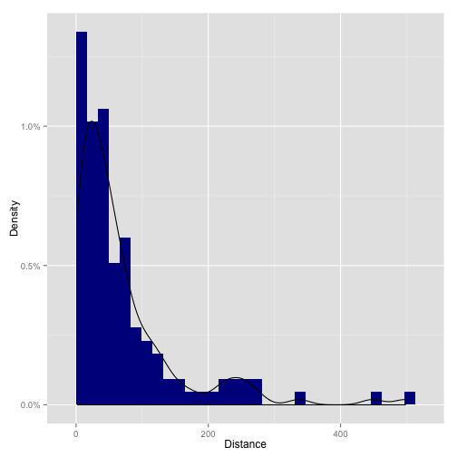 

```r
overdist = subset(motifs, motifs$distance > 250)
overdist
```

```
##           family distance size phyloscore alignscore
## 2   WGD2ANC00031      275   16     0.5906     0.8469
## 30  WGD2ANC01412      266    8     0.8438     0.5062
## 37  WGD2ANC01595      498   14     0.6500     0.8000
## 38  WGD2ANC01669      448    7     0.6000     0.9571
## 85  WGD2ANC03690      337    7     0.5500     0.9357
## 90  WGD2ANC04128      251    7     0.4857     0.8786
## 128 WGD2ANC05674      251   11     0.5636     0.2227
```

Distance > 250 because of alignment. -> Counts "-" as 1 base.
Correlation between distance and sizes?


```r
g = ggplot(motifs, aes(x = size, y = distance)) + labs(x = "Motif Size", y = "Distance from TSS")
g + geom_point() + geom_density2d()
```

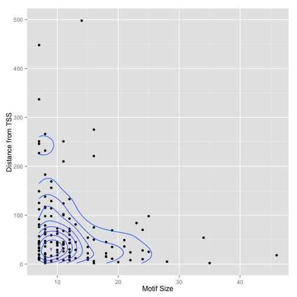 

```r
g + geom_density2d()
```

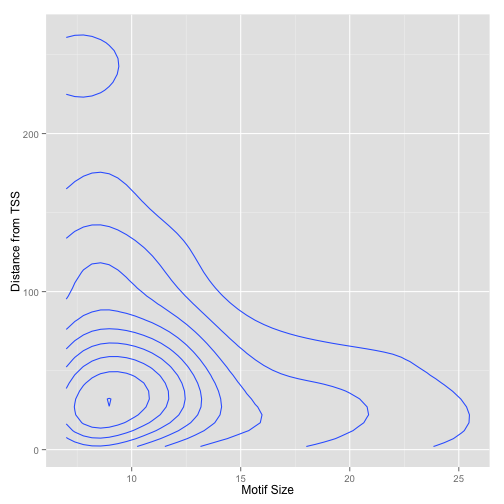 

```r
l = lm(distance ~ size, motifs)
summary(l)
```

```
## 
## Call:
## lm(formula = distance ~ size, data = motifs)
## 
## Residuals:
##    Min     1Q Median     3Q    Max 
##  -79.5  -47.9  -24.1   20.2  431.4 
## 
## Coefficients:
##             Estimate Std. Error t value Pr(>|t|)    
## (Intercept)   101.44      15.56    6.52  1.4e-09 ***
## size           -2.49       1.13   -2.20     0.03 *  
## ---
## Signif. codes:  0 '***' 0.001 '**' 0.01 '*' 0.05 '.' 0.1 ' ' 1
## 
## Residual standard error: 82.5 on 129 degrees of freedom
## Multiple R-squared:  0.0361,	Adjusted R-squared:  0.0286 
## F-statistic: 4.83 on 1 and 129 DF,  p-value: 0.0298
```

```r
g + geom_point() + coord_polar()
```

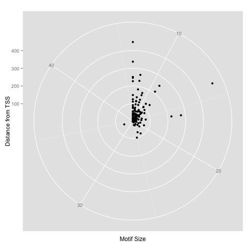 


Scores distribution?


```r
g = ggplot(motifs, aes(x = phyloscore, fill = "darkred"))
g + geom_histogram() + labs(x = "Phylogenetic Score") + scale_y_continuous()
```

```
## stat_bin: binwidth defaulted to range/30. Use 'binwidth = x' to adjust this.
```

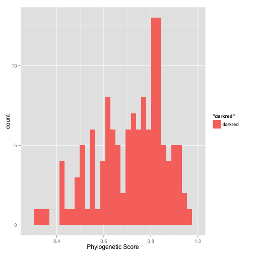 

```r
hist(motifs$phyloscore)
```

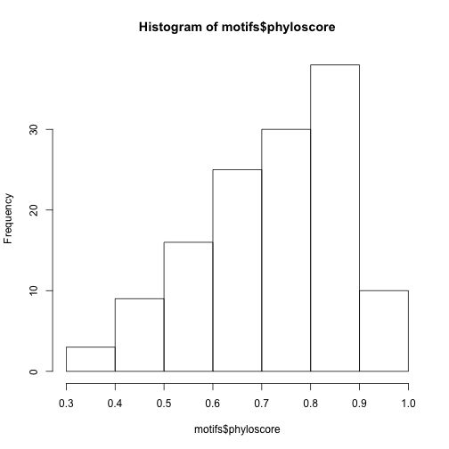 

```r
quantile(motifs$phyloscore, c(0.05, 0.1, 0.25, 0.5, 0.75, 0.9, 0.95, 0.99))
```

```
##     5%    10%    25%    50%    75%    90%    95%    99% 
## 0.4375 0.5100 0.6214 0.7500 0.8315 0.8833 0.9163 0.9331
```

```r
g = ggplot(motifs, aes(x = alignscore)) + labs(x = "Alignment Score")
g + geom_histogram(aes(y = ..density.., fill = "darkred")) + geom_density()
```

```
## stat_bin: binwidth defaulted to range/30. Use 'binwidth = x' to adjust this.
```

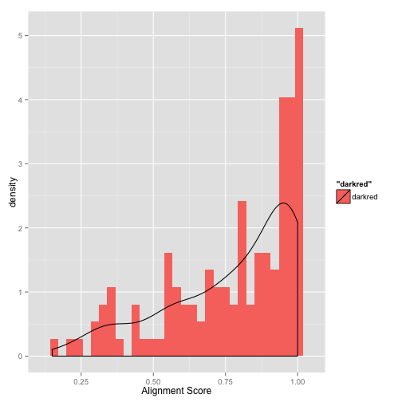 

```r
hist(motifs$alignscore)
```

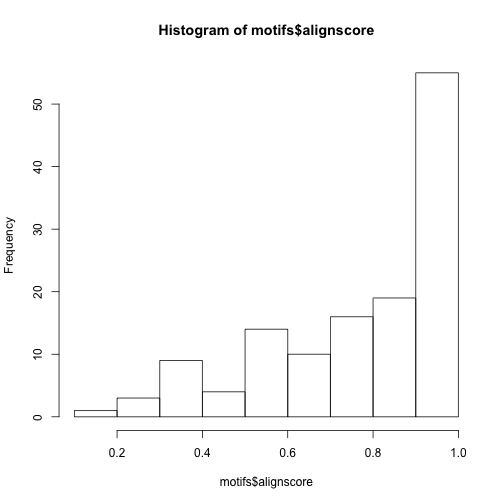 

```r
quantile(motifs$alignscore, c(0.01, 0.05, 0.1, 0.25, 0.5, 0.75, 0.9, 0.95, 0.99))
```

```
##     1%     5%    10%    25%    50%    75%    90%    95%    99% 
## 0.2309 0.3354 0.4272 0.6325 0.8500 0.9643 1.0000 1.0000 1.0000
```

Relation between Alignment and Phylogenetic score?

```r
g = ggplot(motifs, aes(x = phyloscore, y = alignscore))
g + geom_point()
```

 

```r
phyali = lm(phyloscore ~ alignscore, motifs)
summary(phyali)
```

```
## 
## Call:
## lm(formula = phyloscore ~ alignscore, data = motifs)
## 
## Residuals:
##     Min      1Q  Median      3Q     Max 
## -0.3974 -0.1023  0.0385  0.0995  0.2867 
## 
## Coefficients:
##             Estimate Std. Error t value Pr(>|t|)    
## (Intercept)   0.5980     0.0460   13.01   <2e-16 ***
## alignscore    0.1512     0.0569    2.66   0.0088 ** 
## ---
## Signif. codes:  0 '***' 0.001 '**' 0.01 '*' 0.05 '.' 0.1 ' ' 1
## 
## Residual standard error: 0.143 on 129 degrees of freedom
## Multiple R-squared:  0.052,	Adjusted R-squared:  0.0446 
## F-statistic: 7.07 on 1 and 129 DF,  p-value: 0.00883
```


Seems to have positive correlation between alignment and phylogenetic scores.


```r
gen = lm(distance ~ size + phyloscore + alignscore, motifs)
summary(gen)
```

```
## 
## Call:
## lm(formula = distance ~ size + phyloscore + alignscore, data = motifs)
## 
## Residuals:
##    Min     1Q Median     3Q    Max 
## -105.1  -46.0  -26.0   18.7  423.6 
## 
## Coefficients:
##             Estimate Std. Error t value Pr(>|t|)   
## (Intercept)   119.12      40.51    2.94   0.0039 **
## size           -1.79       1.20   -1.49   0.1378   
## phyloscore    -83.99      53.46   -1.57   0.1186   
## alignscore     43.60      33.89    1.29   0.2006   
## ---
## Signif. codes:  0 '***' 0.001 '**' 0.01 '*' 0.05 '.' 0.1 ' ' 1
## 
## Residual standard error: 82.1 on 127 degrees of freedom
## Multiple R-squared:  0.0604,	Adjusted R-squared:  0.0382 
## F-statistic: 2.72 on 3 and 127 DF,  p-value: 0.0472
```


Motifs found by May 5th analysis
========================================================


```r
motifs = read.csv("../05may14.motifs", sep = "\t", h = T)
head(motifs)
```

```
##         family distance size phyloscore alignscore
## 1 WGD2ANC00008       64    5     0.8800     0.9800
## 2 WGD2ANC00010      238    4     0.8750     1.0000
## 3 WGD2ANC00012       10    6     0.8333     0.9167
## 4 WGD2ANC00013        9    5     0.8000     1.0000
## 5 WGD2ANC00014        2    9     0.9444     1.0000
## 6 WGD2ANC00029        3   13     0.9231     1.0000
```


How many motifs are there? What distribution? What families are represented?


```r
library(ggplot2)
library(scales)
g = ggplot(motifs, aes(x = size))
g + geom_histogram(aes(y = ..density..), fill = "darkgreen") + geom_density() + 
    labs(x = "Motif Size", y = "Density") + scale_y_continuous(labels = percent)
```

```
## stat_bin: binwidth defaulted to range/30. Use 'binwidth = x' to adjust this.
```

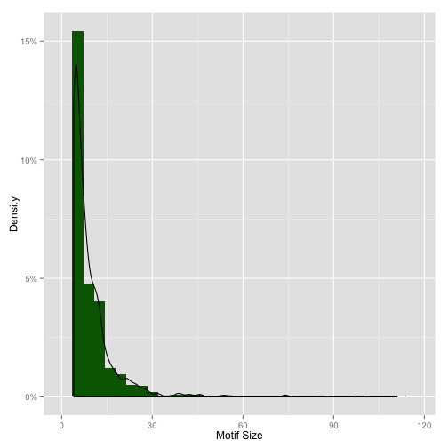 

```r
g + geom_histogram(fill = "darkblue") + labs(x = "Motif Size", y = "Counts")
```

```
## stat_bin: binwidth defaulted to range/30. Use 'binwidth = x' to adjust this.
```

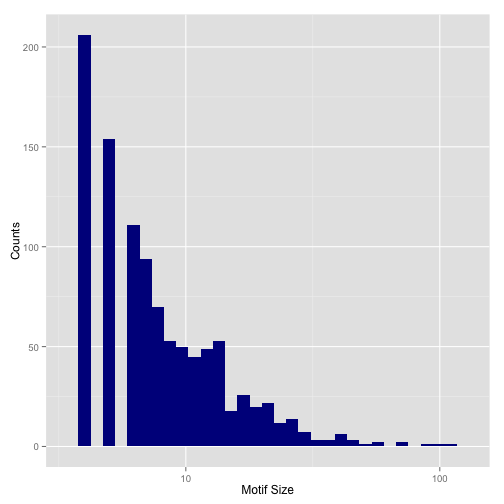 


```r
library(reshape)
cast(motifs, formula = ~family, fun.aggregate = mean)
```

```
## Using alignscore as value column.  Use the value argument to cast to override this choice
```

```
##   value WGD2ANC00008 WGD2ANC00010 WGD2ANC00012 WGD2ANC00013 WGD2ANC00014
## 1 (all)         0.98            1       0.9167            1            1
##   WGD2ANC00029 WGD2ANC00039 WGD2ANC00041 WGD2ANC00043 WGD2ANC00047
## 1            1            1            1         0.92            1
##   WGD2ANC00051 WGD2ANC00055 WGD2ANC00063 WGD2ANC00066 WGD2ANC00075
## 1            1       0.9929            1            1            1
##   WGD2ANC00082 WGD2ANC00083 WGD2ANC00087 WGD2ANC00090 WGD2ANC00093
## 1            1            1            1            1            1
##   WGD2ANC00094 WGD2ANC00096 WGD2ANC00097 WGD2ANC00108 WGD2ANC00121
## 1            1            1            1            1            1
##   WGD2ANC00123 WGD2ANC00132 WGD2ANC00150 WGD2ANC00157 WGD2ANC00161
## 1            1       0.9722            1       0.9773            1
##   WGD2ANC00182 WGD2ANC00188 WGD2ANC00193 WGD2ANC00199 WGD2ANC00203
## 1            1            1       0.9217            1            1
##   WGD2ANC00213 WGD2ANC00238 WGD2ANC00244 WGD2ANC00255 WGD2ANC00258
## 1            1            1            1            1            1
##   WGD2ANC00262 WGD2ANC00264 WGD2ANC00265 WGD2ANC00268 WGD2ANC00300
## 1       0.9286            1            1            1            1
##   WGD2ANC00302 WGD2ANC00309 WGD2ANC00320 WGD2ANC00323 WGD2ANC00324
## 1            1            1            1            1            1
##   WGD2ANC00326 WGD2ANC00339 WGD2ANC00341 WGD2ANC00345 WGD2ANC00354
## 1            1            1            1            1            1
##   WGD2ANC00361 WGD2ANC00365 WGD2ANC00369 WGD2ANC00370 WGD2ANC00379
## 1            1        0.985            1            1            1
##   WGD2ANC00382 WGD2ANC00385 WGD2ANC00386 WGD2ANC00387 WGD2ANC00396
## 1            1            1            1            1            1
##   WGD2ANC00407 WGD2ANC00411 WGD2ANC00416 WGD2ANC00422 WGD2ANC00427
## 1            1            1       0.9545            1            1
##   WGD2ANC00442 WGD2ANC00443 WGD2ANC00444 WGD2ANC00448 WGD2ANC00449
## 1       0.9821            1            1            1            1
##   WGD2ANC00451 WGD2ANC00468 WGD2ANC00482 WGD2ANC00511 WGD2ANC00513
## 1       0.9708            1            1            1            1
##   WGD2ANC00519 WGD2ANC00529 WGD2ANC00566 WGD2ANC00581 WGD2ANC00582
## 1            1        0.875            1            1            1
##   WGD2ANC00589 WGD2ANC00595 WGD2ANC00599 WGD2ANC00600 WGD2ANC00604
## 1            1            1       0.9864            1       0.9844
##   WGD2ANC00629 WGD2ANC00650 WGD2ANC00652 WGD2ANC00654 WGD2ANC00656
## 1            1       0.9762            1            1        0.975
##   WGD2ANC00679 WGD2ANC00680 WGD2ANC00708 WGD2ANC00718 WGD2ANC00722
## 1            1            1            1            1            1
##   WGD2ANC00730 WGD2ANC00736 WGD2ANC00737 WGD2ANC00738 WGD2ANC00751
## 1            1            1            1            1          0.9
##   WGD2ANC00752 WGD2ANC00765 WGD2ANC00770 WGD2ANC00777 WGD2ANC00791
## 1            1            1            1            1            1
##   WGD2ANC00807 WGD2ANC00823 WGD2ANC00827 WGD2ANC00837 WGD2ANC00856
## 1            1            1            1            1       0.9071
##   WGD2ANC00885 WGD2ANC00892 WGD2ANC00898 WGD2ANC00900 WGD2ANC00910
## 1            1            1            1            1            1
##   WGD2ANC00917 WGD2ANC00918 WGD2ANC00921 WGD2ANC00937 WGD2ANC00943
## 1            1            1            1            1            1
##   WGD2ANC00946 WGD2ANC00956 WGD2ANC00958 WGD2ANC00966 WGD2ANC00979
## 1            1       0.9808            1            1       0.9421
##   WGD2ANC01001 WGD2ANC01011 WGD2ANC01015 WGD2ANC01025 WGD2ANC01028
## 1            1            1       0.9583            1            1
##   WGD2ANC01050 WGD2ANC01053 WGD2ANC01054 WGD2ANC01056 WGD2ANC01059
## 1            1            1            1            1       0.9875
##   WGD2ANC01064 WGD2ANC01065 WGD2ANC01089 WGD2ANC01091 WGD2ANC01097
## 1       0.9792         0.95            1            1            1
##   WGD2ANC01102 WGD2ANC01129 WGD2ANC01139 WGD2ANC01145 WGD2ANC01171
## 1       0.9812            1        0.975       0.9708            1
##   WGD2ANC01189 WGD2ANC01203 WGD2ANC01206 WGD2ANC01208 WGD2ANC01219
## 1            1        0.968            1       0.9538            1
##   WGD2ANC01224 WGD2ANC01229 WGD2ANC01231 WGD2ANC01239 WGD2ANC01243
## 1            1            1       0.9545       0.8929            1
##   WGD2ANC01246 WGD2ANC01247 WGD2ANC01250 WGD2ANC01263 WGD2ANC01266
## 1            1            1            1            1        0.975
##   WGD2ANC01269 WGD2ANC01271 WGD2ANC01284 WGD2ANC01290 WGD2ANC01291
## 1            1            1            1            1            1
##   WGD2ANC01305 WGD2ANC01309 WGD2ANC01312 WGD2ANC01329 WGD2ANC01330
## 1            1            1            1            1            1
##   WGD2ANC01333 WGD2ANC01335 WGD2ANC01337 WGD2ANC01340 WGD2ANC01366
## 1            1       0.9667            1            1            1
##   WGD2ANC01368 WGD2ANC01376 WGD2ANC01384 WGD2ANC01385 WGD2ANC01392
## 1            1            1        0.875            1            1
##   WGD2ANC01394 WGD2ANC01402 WGD2ANC01424 WGD2ANC01435 WGD2ANC01443
## 1            1            1         0.99            1       0.9545
##   WGD2ANC01446 WGD2ANC01449 WGD2ANC01450 WGD2ANC01461 WGD2ANC01463
## 1            1            1            1        0.875            1
##   WGD2ANC01474 WGD2ANC01481 WGD2ANC01487 WGD2ANC01497 WGD2ANC01504
## 1            1            1            1            1            1
##   WGD2ANC01516 WGD2ANC01523 WGD2ANC01529 WGD2ANC01530 WGD2ANC01533
## 1            1            1        0.975            1            1
##   WGD2ANC01556 WGD2ANC01576 WGD2ANC01577 WGD2ANC01582 WGD2ANC01586
## 1            1            1            1            1            1
##   WGD2ANC01592 WGD2ANC01604 WGD2ANC01624 WGD2ANC01626 WGD2ANC01627
## 1       0.9313            1            1       0.9375            1
##   WGD2ANC01628 WGD2ANC01641 WGD2ANC01647 WGD2ANC01679 WGD2ANC01694
## 1            1            1       0.9773            1            1
##   WGD2ANC01707 WGD2ANC01712 WGD2ANC01715 WGD2ANC01716 WGD2ANC01721
## 1            1            1         0.96            1            1
##   WGD2ANC01729 WGD2ANC01731 WGD2ANC01732 WGD2ANC01747 WGD2ANC01760
## 1            1            1            1       0.9545            1
##   WGD2ANC01761 WGD2ANC01770 WGD2ANC01779 WGD2ANC01787 WGD2ANC01788
## 1            1       0.9812        0.975            1            1
##   WGD2ANC01789 WGD2ANC01794 WGD2ANC01827 WGD2ANC01837 WGD2ANC01838
## 1            1            1            1            1        0.975
##   WGD2ANC01860 WGD2ANC01865 WGD2ANC01868 WGD2ANC01871 WGD2ANC01873
## 1            1            1            1            1            1
##   WGD2ANC01874 WGD2ANC01875 WGD2ANC01876 WGD2ANC01884 WGD2ANC01917
## 1            1            1            1            1         0.99
##   WGD2ANC01924 WGD2ANC01925 WGD2ANC01929 WGD2ANC01930 WGD2ANC01937
## 1            1         0.96            1            1            1
##   WGD2ANC01941 WGD2ANC01950 WGD2ANC01953 WGD2ANC01954 WGD2ANC01962
## 1            1            1            1            1            1
##   WGD2ANC01969 WGD2ANC01981 WGD2ANC01982 WGD2ANC01993 WGD2ANC01995
## 1            1       0.7875            1       0.9257            1
##   WGD2ANC01998 WGD2ANC02003 WGD2ANC02020 WGD2ANC02022 WGD2ANC02032
## 1            1            1       0.9648            1            1
##   WGD2ANC02042 WGD2ANC02043 WGD2ANC02044 WGD2ANC02045 WGD2ANC02047
## 1            1            1            1            1            1
##   WGD2ANC02053 WGD2ANC02057 WGD2ANC02059 WGD2ANC02062 WGD2ANC02066
## 1            1        0.925            1            1            1
##   WGD2ANC02074 WGD2ANC02077 WGD2ANC02085 WGD2ANC02087 WGD2ANC02099
## 1            1            1            1       0.9861            1
##   WGD2ANC02111 WGD2ANC02117 WGD2ANC02133 WGD2ANC02134 WGD2ANC02145
## 1            1            1            1            1       0.9907
##   WGD2ANC02149 WGD2ANC02156 WGD2ANC02159 WGD2ANC02163 WGD2ANC02170
## 1       0.9857            1            1            1            1
##   WGD2ANC02197 WGD2ANC02216 WGD2ANC02226 WGD2ANC02227 WGD2ANC02236
## 1            1            1            1            1         0.92
##   WGD2ANC02244 WGD2ANC02245 WGD2ANC02254 WGD2ANC02273 WGD2ANC02277
## 1            1            1            1            1            1
##   WGD2ANC02288 WGD2ANC02289 WGD2ANC02303 WGD2ANC02312 WGD2ANC02313
## 1       0.9792            1            1            1            1
##   WGD2ANC02327 WGD2ANC02334 WGD2ANC02342 WGD2ANC02348 WGD2ANC02352
## 1            1            1            1            1            1
##   WGD2ANC02362 WGD2ANC02363 WGD2ANC02365 WGD2ANC02370 WGD2ANC02371
## 1         0.94       0.9583            1            1        0.875
##   WGD2ANC02376 WGD2ANC02377 WGD2ANC02404 WGD2ANC02409 WGD2ANC02424
## 1         0.91            1            1            1       0.9333
##   WGD2ANC02426 WGD2ANC02454 WGD2ANC02455 WGD2ANC02462 WGD2ANC02468
## 1       0.9889            1       0.9917            1            1
##   WGD2ANC02469 WGD2ANC02473 WGD2ANC02502 WGD2ANC02513 WGD2ANC02534
## 1            1            1            1            1       0.9625
##   WGD2ANC02546 WGD2ANC02549 WGD2ANC02555 WGD2ANC02571 WGD2ANC02578
## 1            1            1            1            1       0.9375
##   WGD2ANC02591 WGD2ANC02598 WGD2ANC02599 WGD2ANC02619 WGD2ANC02624
## 1            1            1            1            1            1
##   WGD2ANC02640 WGD2ANC02642 WGD2ANC02647 WGD2ANC02655 WGD2ANC02663
## 1         0.95            1       0.9688       0.9667            1
##   WGD2ANC02671 WGD2ANC02676 WGD2ANC02682 WGD2ANC02683 WGD2ANC02691
## 1            1          0.9            1            1            1
##   WGD2ANC02693 WGD2ANC02697 WGD2ANC02698 WGD2ANC02709 WGD2ANC02710
## 1            1            1            1            1            1
##   WGD2ANC02735 WGD2ANC02745 WGD2ANC02757 WGD2ANC02758 WGD2ANC02760
## 1            1         0.93            1            1            1
##   WGD2ANC02782 WGD2ANC02786 WGD2ANC02790 WGD2ANC02793 WGD2ANC02806
## 1            1       0.9667            1            1            1
##   WGD2ANC02808 WGD2ANC02810 WGD2ANC02819 WGD2ANC02824 WGD2ANC02845
## 1            1            1       0.9583            1       0.9583
##   WGD2ANC02852 WGD2ANC02866 WGD2ANC02869 WGD2ANC02876 WGD2ANC02882
## 1            1            1       0.9125            1            1
##   WGD2ANC02883 WGD2ANC02898 WGD2ANC02906 WGD2ANC02929 WGD2ANC02931
## 1            1            1            1            1            1
##   WGD2ANC02964 WGD2ANC02974 WGD2ANC03002 WGD2ANC03008 WGD2ANC03011
## 1            1            1       0.9125       0.9333            1
##   WGD2ANC03017 WGD2ANC03027 WGD2ANC03035 WGD2ANC03040 WGD2ANC03048
## 1            1            1       0.9917            1            1
##   WGD2ANC03053 WGD2ANC03075 WGD2ANC03085 WGD2ANC03086 WGD2ANC03088
## 1            1            1            1            1         0.97
##   WGD2ANC03100 WGD2ANC03115 WGD2ANC03119 WGD2ANC03126 WGD2ANC03129
## 1       0.9071       0.9808            1            1         0.97
##   WGD2ANC03133 WGD2ANC03139 WGD2ANC03142 WGD2ANC03143 WGD2ANC03153
## 1            1            1            1            1            1
##   WGD2ANC03158 WGD2ANC03159 WGD2ANC03164 WGD2ANC03168 WGD2ANC03179
## 1            1            1       0.9286            1            1
##   WGD2ANC03181 WGD2ANC03183 WGD2ANC03192 WGD2ANC03195 WGD2ANC03199
## 1            1          0.9            1            1            1
##   WGD2ANC03206 WGD2ANC03220 WGD2ANC03224 WGD2ANC03232 WGD2ANC03235
## 1            1            1            1            1            1
##   WGD2ANC03243 WGD2ANC03255 WGD2ANC03279 WGD2ANC03281 WGD2ANC03284
## 1       0.9615            1         0.85        0.925       0.9833
##   WGD2ANC03295 WGD2ANC03297 WGD2ANC03306 WGD2ANC03316 WGD2ANC03336
## 1            1       0.9722            1            1            1
##   WGD2ANC03356 WGD2ANC03364 WGD2ANC03365 WGD2ANC03381 WGD2ANC03383
## 1            1            1            1            1            1
##   WGD2ANC03387 WGD2ANC03398 WGD2ANC03400 WGD2ANC03410 WGD2ANC03417
## 1            1            1            1            1            1
##   WGD2ANC03418 WGD2ANC03420 WGD2ANC03422 WGD2ANC03426 WGD2ANC03430
## 1            1            1            1            1            1
##   WGD2ANC03437 WGD2ANC03453 WGD2ANC03467 WGD2ANC03474 WGD2ANC03481
## 1            1         0.95       0.9933            1            1
##   WGD2ANC03482 WGD2ANC03492 WGD2ANC03500 WGD2ANC03503 WGD2ANC03509
## 1            1       0.9696            1            1            1
##   WGD2ANC03512 WGD2ANC03525 WGD2ANC03528 WGD2ANC03529 WGD2ANC03538
## 1            1            1            1            1            1
##   WGD2ANC03539 WGD2ANC03545 WGD2ANC03549 WGD2ANC03567 WGD2ANC03568
## 1            1       0.8667            1            1            1
##   WGD2ANC03569 WGD2ANC03576 WGD2ANC03581 WGD2ANC03594 WGD2ANC03604
## 1            1            1       0.9312       0.9444       0.8583
##   WGD2ANC03626 WGD2ANC03636 WGD2ANC03657 WGD2ANC03659 WGD2ANC03661
## 1            1            1            1       0.9286            1
##   WGD2ANC03671 WGD2ANC03689 WGD2ANC03702 WGD2ANC03707 WGD2ANC03709
## 1         0.85            1            1            1            1
##   WGD2ANC03720 WGD2ANC03724 WGD2ANC03726 WGD2ANC03728 WGD2ANC03759
## 1            1            1            1            1            1
##   WGD2ANC03774 WGD2ANC03782 WGD2ANC03785 WGD2ANC03795 WGD2ANC03813
## 1            1            1            1       0.9275            1
##   WGD2ANC03831 WGD2ANC03843 WGD2ANC03863 WGD2ANC03865 WGD2ANC03868
## 1            1            1            1            1            1
##   WGD2ANC03877 WGD2ANC03878 WGD2ANC03883 WGD2ANC03891 WGD2ANC03895
## 1            1            1       0.9709            1            1
##   WGD2ANC03898 WGD2ANC03900 WGD2ANC03918 WGD2ANC03920 WGD2ANC03933
## 1            1            1            1            1            1
##   WGD2ANC03935 WGD2ANC03938 WGD2ANC03943 WGD2ANC03947 WGD2ANC03954
## 1            1            1            1            1            1
##   WGD2ANC03962 WGD2ANC03965 WGD2ANC03968 WGD2ANC03998 WGD2ANC04000
## 1            1       0.9583            1            1            1
##   WGD2ANC04010 WGD2ANC04012 WGD2ANC04013 WGD2ANC04016 WGD2ANC04021
## 1            1            1            1            1            1
##   WGD2ANC04022 WGD2ANC04031 WGD2ANC04036 WGD2ANC04039 WGD2ANC04082
## 1            1            1            1            1       0.9393
##   WGD2ANC04119 WGD2ANC04120 WGD2ANC04125 WGD2ANC04135 WGD2ANC04136
## 1            1            1            1            1            1
##   WGD2ANC04137 WGD2ANC04155 WGD2ANC04202 WGD2ANC04215 WGD2ANC04221
## 1            1            1       0.9167            1            1
##   WGD2ANC04255 WGD2ANC04264 WGD2ANC04265 WGD2ANC04270 WGD2ANC04279
## 1            1        0.905       0.9688            1            1
##   WGD2ANC04286 WGD2ANC04309 WGD2ANC04325 WGD2ANC04342 WGD2ANC04345
## 1            1            1            1            1            1
##   WGD2ANC04349 WGD2ANC04351 WGD2ANC04356 WGD2ANC04358 WGD2ANC04365
## 1       0.9556            1       0.8857            1            1
##   WGD2ANC04374 WGD2ANC04378 WGD2ANC04391 WGD2ANC04403 WGD2ANC04410
## 1            1       0.9632            1            1       0.9792
##   WGD2ANC04413 WGD2ANC04421 WGD2ANC04422 WGD2ANC04425 WGD2ANC04437
## 1            1            1            1            1          0.9
##   WGD2ANC04442 WGD2ANC04448 WGD2ANC04457 WGD2ANC04458 WGD2ANC04473
## 1            1            1            1            1       0.9667
##   WGD2ANC04504 WGD2ANC04507 WGD2ANC04513 WGD2ANC04519 WGD2ANC04528
## 1            1        0.975            1            1       0.9375
##   WGD2ANC04564 WGD2ANC04573 WGD2ANC04577 WGD2ANC04594 WGD2ANC04599
## 1            1            1            1            1            1
##   WGD2ANC04620 WGD2ANC04623 WGD2ANC04624 WGD2ANC04659 WGD2ANC04664
## 1            1            1            1            1       0.9977
##   WGD2ANC04667 WGD2ANC04670 WGD2ANC04676 WGD2ANC04678 WGD2ANC04694
## 1            1            1            1            1            1
##   WGD2ANC04712 WGD2ANC04719 WGD2ANC04720 WGD2ANC04741 WGD2ANC04746
## 1            1            1       0.9286            1            1
##   WGD2ANC04747 WGD2ANC04750 WGD2ANC04755 WGD2ANC04771 WGD2ANC04786
## 1            1          0.9            1            1            1
##   WGD2ANC04787 WGD2ANC04798 WGD2ANC04801 WGD2ANC04815 WGD2ANC04818
## 1            1            1            1        0.975            1
##   WGD2ANC04828 WGD2ANC04836 WGD2ANC04837 WGD2ANC04840 WGD2ANC04864
## 1            1            1            1            1       0.9688
##   WGD2ANC04887 WGD2ANC04916 WGD2ANC04918 WGD2ANC04922 WGD2ANC04943
## 1            1            1            1            1            1
##   WGD2ANC04949 WGD2ANC04960 WGD2ANC04963 WGD2ANC04989 WGD2ANC04999
## 1       0.9444            1            1            1            1
##   WGD2ANC05009 WGD2ANC05017 WGD2ANC05019 WGD2ANC05021 WGD2ANC05024
## 1            1            1       0.9688        0.875            1
##   WGD2ANC05025 WGD2ANC05039 WGD2ANC05043 WGD2ANC05051 WGD2ANC05057
## 1            1            1       0.9625       0.9167            1
##   WGD2ANC05059 WGD2ANC05067 WGD2ANC05093 WGD2ANC05103 WGD2ANC05110
## 1            1            1            1       0.9636            1
##   WGD2ANC05118 WGD2ANC05122 WGD2ANC05123 WGD2ANC05162 WGD2ANC05174
## 1            1            1            1         0.96            1
##   WGD2ANC05179 WGD2ANC05181 WGD2ANC05185 WGD2ANC05202 WGD2ANC05205
## 1         0.95            1            1       0.9583            1
##   WGD2ANC05213 WGD2ANC05233 WGD2ANC05237 WGD2ANC05245 WGD2ANC05252
## 1            1            1            1            1            1
##   WGD2ANC05260 WGD2ANC05261 WGD2ANC05263 WGD2ANC05274 WGD2ANC05275
## 1            1            1         0.95            1            1
##   WGD2ANC05276 WGD2ANC05278 WGD2ANC05279 WGD2ANC05287 WGD2ANC05289
## 1            1            1            1            1            1
##   WGD2ANC05297 WGD2ANC05304 WGD2ANC05306 WGD2ANC05322 WGD2ANC05325
## 1            1            1            1            1            1
##   WGD2ANC05330 WGD2ANC05341 WGD2ANC05357 WGD2ANC05358 WGD2ANC05363
## 1         0.95            1            1            1        0.975
##   WGD2ANC05364 WGD2ANC05369 WGD2ANC05402 WGD2ANC05409 WGD2ANC05413
## 1            1            1            1            1            1
##   WGD2ANC05424 WGD2ANC05431 WGD2ANC05434 WGD2ANC05436 WGD2ANC05437
## 1            1            1            1            1            1
##   WGD2ANC05447 WGD2ANC05463 WGD2ANC05464 WGD2ANC05465 WGD2ANC05475
## 1            1            1            1            1            1
##   WGD2ANC05478 WGD2ANC05480 WGD2ANC05481 WGD2ANC05489 WGD2ANC05494
## 1       0.9688            1            1            1            1
##   WGD2ANC05495 WGD2ANC05501 WGD2ANC05505 WGD2ANC05510 WGD2ANC05519
## 1            1            1            1            1            1
##   WGD2ANC05520 WGD2ANC05526 WGD2ANC05528 WGD2ANC05529 WGD2ANC05532
## 1            1            1            1       0.9583            1
##   WGD2ANC05536 WGD2ANC05537 WGD2ANC05547 WGD2ANC05548 WGD2ANC05560
## 1            1            1            1            1            1
##   WGD2ANC05563 WGD2ANC05567 WGD2ANC05574 WGD2ANC05598 WGD2ANC05600
## 1            1            1            1            1            1
##   WGD2ANC05606 WGD2ANC05610 WGD2ANC05619 WGD2ANC05624 WGD2ANC05631
## 1            1            1            1       0.9167            1
##   WGD2ANC05636 WGD2ANC05641 WGD2ANC05654 WGD2ANC05657 WGD2ANC05661
## 1            1            1         0.92            1       0.9545
##   WGD2ANC05669 WGD2ANC05670 WGD2ANC05671 WGD2ANC05687 WGD2ANC05691
## 1            1            1            1            1            1
##   WGD2ANC05697 WGD2ANC05701 WGD2ANC05715 WGD2ANC05720 WGD2ANC05722
## 1            1            1            1            1            1
##   WGD2ANC05730 WGD2ANC05751 WGD2ANC05759 WGD2ANC05771 WGD2ANC05778
## 1            1            1            1            1            1
```

```r
quantile(motifs$size, c(0.05, 0.1, 0.25, 0.5, 0.75, 0.9, 0.95))
```

```
##  5% 10% 25% 50% 75% 90% 95% 
##   4   4   5   7  11  17  23
```

```r
summary(motifs)
```

```
##           family       distance          size          phyloscore   
##  WGD2ANC04504: 11   Min.   :  2.0   Min.   :  4.00   Min.   :0.738  
##  WGD2ANC01474: 10   1st Qu.:  7.0   1st Qu.:  5.00   1st Qu.:0.875  
##  WGD2ANC01450:  8   Median : 23.0   Median :  7.00   Median :0.929  
##  WGD2ANC01329:  7   Mean   : 54.7   Mean   :  9.56   Mean   :0.916  
##  WGD2ANC00752:  6   3rd Qu.: 82.0   3rd Qu.: 11.00   3rd Qu.:0.962  
##  WGD2ANC00943:  6   Max.   :245.0   Max.   :111.00   Max.   :1.000  
##  (Other)     :979                                                   
##    alignscore   
##  Min.   :0.787  
##  1st Qu.:1.000  
##  Median :1.000  
##  Mean   :0.991  
##  3rd Qu.:1.000  
##  Max.   :1.000  
## 
```

```r

# Show the two families with maximum occurrences

motifs[motifs$family == "WGD2ANC04473", ]
```

```
##           family distance size phyloscore alignscore
## 792 WGD2ANC04473       20    5     0.9600       1.00
## 793 WGD2ANC04473       60   13     0.9038       0.95
## 794 WGD2ANC04473      101    5     0.9800       0.95
```

```r
motifs[motifs$family == "WGD2ANC00182", ]
```

```
##          family distance size phyloscore alignscore
## 46 WGD2ANC00182        4   14       0.95          1
```

```r


# Show maximum and minimum
motifs[motifs$size == max(motifs$size), ]
```

```
##            family distance size phyloscore alignscore
## 1009 WGD2ANC05671        2  111     0.9955          1
```

```r
motifs[motifs$size == min(motifs$size), ]
```

```
##            family distance size phyloscore alignscore
## 2    WGD2ANC00010      238    4     0.8750     1.0000
## 9    WGD2ANC00039        8    4     0.8750     1.0000
## 11   WGD2ANC00041       29    4     0.7500     1.0000
## 21   WGD2ANC00083       49    4     0.8750     1.0000
## 24   WGD2ANC00090        6    4     0.8750     1.0000
## 36   WGD2ANC00121      140    4     0.8750     1.0000
## 47   WGD2ANC00188       14    4     0.7500     1.0000
## 52   WGD2ANC00213       21    4     0.8750     1.0000
## 55   WGD2ANC00244       15    4     0.8750     1.0000
## 57   WGD2ANC00258       10    4     0.8750     1.0000
## 62   WGD2ANC00265       71    4     0.9500     1.0000
## 79   WGD2ANC00354        2    4     0.7500     1.0000
## 81   WGD2ANC00361       32    4     0.7500     1.0000
## 82   WGD2ANC00365      163    4     0.9625     1.0000
## 84   WGD2ANC00369       15    4     0.8750     1.0000
## 88   WGD2ANC00385       18    4     0.7500     1.0000
## 90   WGD2ANC00387       80    4     0.9375     1.0000
## 101  WGD2ANC00443       28    4     0.9375     1.0000
## 113  WGD2ANC00529       13    4     1.0000     0.8750
## 120  WGD2ANC00600       28    4     0.8750     1.0000
## 126  WGD2ANC00652       19    4     0.8750     1.0000
## 131  WGD2ANC00679       13    4     0.8750     1.0000
## 140  WGD2ANC00738       13    4     0.8750     1.0000
## 145  WGD2ANC00752       95    4     0.8750     1.0000
## 146  WGD2ANC00752      118    4     0.8750     1.0000
## 162  WGD2ANC00885      183    4     0.8750     1.0000
## 167  WGD2ANC00910      168    4     0.8750     1.0000
## 175  WGD2ANC00937       69    4     0.8750     1.0000
## 188  WGD2ANC00958       17    4     0.9625     1.0000
## 193  WGD2ANC01011       12    4     0.9750     1.0000
## 201  WGD2ANC01056       11    4     0.8750     1.0000
## 202  WGD2ANC01056      191    4     0.8750     1.0000
## 205  WGD2ANC01065       31    4     0.9625     0.9500
## 215  WGD2ANC01145       77    4     0.9375     0.9375
## 218  WGD2ANC01171       18    4     0.8750     1.0000
## 220  WGD2ANC01171       77    4     0.8750     1.0000
## 230  WGD2ANC01219       87    4     0.9250     1.0000
## 235  WGD2ANC01243      130    4     0.8750     1.0000
## 236  WGD2ANC01246       31    4     0.9750     1.0000
## 237  WGD2ANC01247       34    4     0.8750     1.0000
## 240  WGD2ANC01266      178    4     0.8625     0.9750
## 243  WGD2ANC01284       20    4     0.8750     1.0000
## 256  WGD2ANC01329      229    4     0.8750     1.0000
## 265  WGD2ANC01384        3    4     1.0000     0.8750
## 268  WGD2ANC01394       22    4     0.8750     1.0000
## 269  WGD2ANC01394       33    4     0.8750     1.0000
## 276  WGD2ANC01449      142    4     0.7500     1.0000
## 284  WGD2ANC01450      230    4     0.7500     1.0000
## 285  WGD2ANC01461       10    4     1.0000     0.8750
## 291  WGD2ANC01474       90    4     0.8750     1.0000
## 295  WGD2ANC01474      181    4     0.8750     1.0000
## 297  WGD2ANC01481       14    4     0.9250     1.0000
## 299  WGD2ANC01497       97    4     0.8750     1.0000
## 325  WGD2ANC01679       92    4     0.8750     1.0000
## 332  WGD2ANC01716       53    4     0.8750     1.0000
## 338  WGD2ANC01731       24    4     0.9250     1.0000
## 342  WGD2ANC01761       39    4     0.9625     1.0000
## 345  WGD2ANC01779       31    4     1.0000     0.9500
## 352  WGD2ANC01794       50    4     0.7500     1.0000
## 358  WGD2ANC01838      195    4     0.9125     0.9750
## 361  WGD2ANC01868       29    4     0.7500     1.0000
## 364  WGD2ANC01874       43    4     0.9500     1.0000
## 365  WGD2ANC01875      182    4     0.8750     1.0000
## 378  WGD2ANC01950       60    4     0.8750     1.0000
## 383  WGD2ANC01981       31    4     0.9375     0.7875
## 387  WGD2ANC01993       47    4     0.9625     0.9125
## 388  WGD2ANC01995       17    4     0.9625     1.0000
## 393  WGD2ANC02020       26    4     0.7500     0.8750
## 400  WGD2ANC02044       44    4     0.8250     1.0000
## 401  WGD2ANC02045        6    4     0.8750     1.0000
## 414  WGD2ANC02099        7    4     0.8750     1.0000
## 421  WGD2ANC02134       29    4     0.8625     1.0000
## 424  WGD2ANC02145      139    4     0.8750     1.0000
## 431  WGD2ANC02216        2    4     0.8750     1.0000
## 439  WGD2ANC02273       24    4     0.7500     1.0000
## 449  WGD2ANC02312        3    4     0.8750     1.0000
## 463  WGD2ANC02371        9    4     0.7500     0.8750
## 467  WGD2ANC02404       12    4     0.8750     1.0000
## 479  WGD2ANC02534       89    4     0.8500     0.9625
## 481  WGD2ANC02546      125    4     0.7500     1.0000
## 484  WGD2ANC02555       60    4     0.9500     1.0000
## 486  WGD2ANC02578       69    4     0.7375     0.8750
## 487  WGD2ANC02578      120    4     0.9250     1.0000
## 490  WGD2ANC02599       49    4     0.8750     1.0000
## 491  WGD2ANC02619       63    4     0.7500     1.0000
## 499  WGD2ANC02655       16    4     0.8750     1.0000
## 501  WGD2ANC02663      113    4     0.8750     1.0000
## 504  WGD2ANC02682       19    4     0.8750     1.0000
## 507  WGD2ANC02691       69    4     0.8750     1.0000
## 508  WGD2ANC02691      107    4     0.8750     1.0000
## 509  WGD2ANC02693       11    4     0.8750     1.0000
## 521  WGD2ANC02782       91    4     0.8750     1.0000
## 537  WGD2ANC02866        9    4     0.8750     1.0000
## 538  WGD2ANC02869       36    4     0.9750     0.9125
## 542  WGD2ANC02898       23    4     0.8750     1.0000
## 553  WGD2ANC02974       27    4     0.8750     1.0000
## 554  WGD2ANC03002      219    4     0.9500     0.9125
## 558  WGD2ANC03027       38    4     0.7500     1.0000
## 562  WGD2ANC03048      120    4     0.8750     1.0000
## 568  WGD2ANC03086       83    4     0.8750     1.0000
## 580  WGD2ANC03143      175    4     0.7500     1.0000
## 583  WGD2ANC03159        2    4     0.7500     1.0000
## 588  WGD2ANC03181       48    4     0.9500     1.0000
## 603  WGD2ANC03255       89    4     0.7500     1.0000
## 605  WGD2ANC03281        2    4     0.7500     0.9250
## 616  WGD2ANC03365       12    4     0.7500     1.0000
## 617  WGD2ANC03381       20    4     0.9500     1.0000
## 621  WGD2ANC03400       46    4     0.8750     1.0000
## 622  WGD2ANC03410        4    4     0.7500     1.0000
## 629  WGD2ANC03426       35    4     0.8250     1.0000
## 632  WGD2ANC03453        3    4     0.9625     0.9500
## 635  WGD2ANC03467       93    4     0.7500     1.0000
## 649  WGD2ANC03509       17    4     0.7500     1.0000
## 655  WGD2ANC03538        5    4     0.7500     1.0000
## 656  WGD2ANC03539      153    4     0.9375     1.0000
## 665  WGD2ANC03581       38    4     0.8625     0.9500
## 669  WGD2ANC03636       28    4     0.9625     1.0000
## 673  WGD2ANC03661       20    4     0.8750     1.0000
## 675  WGD2ANC03671       15    4     0.9500     0.8500
## 676  WGD2ANC03689        8    4     0.7500     1.0000
## 683  WGD2ANC03726      182    4     0.8750     1.0000
## 685  WGD2ANC03759       19    4     0.8750     1.0000
## 686  WGD2ANC03759       84    4     0.7500     1.0000
## 687  WGD2ANC03759      140    4     0.8750     1.0000
## 692  WGD2ANC03795       10    4     0.9875     0.8750
## 699  WGD2ANC03865      132    4     0.8750     1.0000
## 702  WGD2ANC03878      175    4     0.7500     1.0000
## 709  WGD2ANC03895       15    4     0.7500     1.0000
## 714  WGD2ANC03920       69    4     0.7500     1.0000
## 717  WGD2ANC03938       11    4     0.7500     1.0000
## 724  WGD2ANC03968       64    4     0.7500     1.0000
## 732  WGD2ANC04021       69    4     0.8750     1.0000
## 735  WGD2ANC04036      185    4     0.8750     1.0000
## 736  WGD2ANC04039       79    4     0.8750     1.0000
## 745  WGD2ANC04155       83    4     0.8750     1.0000
## 747  WGD2ANC04215       15    4     0.8750     1.0000
## 750  WGD2ANC04255       32    4     0.9375     1.0000
## 754  WGD2ANC04265        2    4     1.0000     0.8750
## 755  WGD2ANC04265        7    4     0.8750     1.0000
## 759  WGD2ANC04279       78    4     0.7500     1.0000
## 764  WGD2ANC04345       70    4     0.7500     1.0000
## 769  WGD2ANC04365      154    4     0.7750     1.0000
## 772  WGD2ANC04378       23    4     0.9750     0.9875
## 774  WGD2ANC04403       25    4     0.7500     1.0000
## 778  WGD2ANC04413      102    4     0.8750     1.0000
## 802  WGD2ANC04504      160    4     0.8750     1.0000
## 803  WGD2ANC04504      182    4     0.8750     1.0000
## 806  WGD2ANC04507      168    4     0.8625     0.9750
## 807  WGD2ANC04513        3    4     0.7500     1.0000
## 813  WGD2ANC04577       23    4     0.8750     1.0000
## 815  WGD2ANC04599        5    4     0.9750     1.0000
## 816  WGD2ANC04620       45    4     0.8750     1.0000
## 817  WGD2ANC04623        4    4     0.8750     1.0000
## 819  WGD2ANC04624       16    4     0.8750     1.0000
## 821  WGD2ANC04659       36    4     0.9375     1.0000
## 824  WGD2ANC04667       10    4     0.7500     1.0000
## 826  WGD2ANC04670       42    4     0.8750     1.0000
## 828  WGD2ANC04678       14    4     0.7500     1.0000
## 831  WGD2ANC04719       82    4     0.9375     1.0000
## 839  WGD2ANC04771       60    4     0.7500     1.0000
## 842  WGD2ANC04787      177    4     0.8000     1.0000
## 845  WGD2ANC04801       52    4     0.8750     1.0000
## 846  WGD2ANC04815       36    4     0.9750     0.9750
## 847  WGD2ANC04818       20    4     0.7500     1.0000
## 848  WGD2ANC04828      169    4     0.7500     1.0000
## 849  WGD2ANC04836       38    4     0.8750     1.0000
## 850  WGD2ANC04836      242    4     0.8750     1.0000
## 854  WGD2ANC04864       12    4     0.7500     0.8750
## 856  WGD2ANC04864       39    4     0.8750     1.0000
## 858  WGD2ANC04887        2    4     0.8750     1.0000
## 859  WGD2ANC04916        3    4     0.7500     1.0000
## 863  WGD2ANC04922      138    4     0.8750     1.0000
## 869  WGD2ANC04963      137    4     0.8750     1.0000
## 876  WGD2ANC05017       16    4     0.8750     1.0000
## 877  WGD2ANC05017       63    4     0.8750     1.0000
## 879  WGD2ANC05019       14    4     0.8750     1.0000
## 880  WGD2ANC05021       11    4     0.7500     0.8750
## 881  WGD2ANC05024       17    4     0.8750     1.0000
## 882  WGD2ANC05025       99    4     0.8750     1.0000
## 885  WGD2ANC05043       22    4     0.8875     0.9625
## 896  WGD2ANC05110        3    4     0.7500     1.0000
## 899  WGD2ANC05123      117    4     0.9375     1.0000
## 901  WGD2ANC05174       11    4     0.8750     1.0000
## 902  WGD2ANC05179       24    4     0.8750     1.0000
## 907  WGD2ANC05202      114    4     1.0000     0.8750
## 908  WGD2ANC05202      120    4     0.8750     1.0000
## 913  WGD2ANC05237      202    4     0.8750     1.0000
## 918  WGD2ANC05261      190    4     0.7500     1.0000
## 919  WGD2ANC05263       32    4     0.8750     1.0000
## 925  WGD2ANC05278        3    4     0.8750     1.0000
## 927  WGD2ANC05287       28    4     0.7750     1.0000
## 928  WGD2ANC05289       10    4     0.7500     1.0000
## 930  WGD2ANC05304       17    4     0.8750     1.0000
## 938  WGD2ANC05363       23    4     0.9375     0.9750
## 951  WGD2ANC05447       61    4     0.7500     1.0000
## 961  WGD2ANC05478       32    4     0.7500     0.8750
## 966  WGD2ANC05480      205    4     0.8750     1.0000
## 969  WGD2ANC05489        4    4     0.7500     1.0000
## 970  WGD2ANC05494       48    4     0.8750     1.0000
## 972  WGD2ANC05495       16    4     0.8750     1.0000
## 988  WGD2ANC05548       16    4     0.8750     1.0000
## 998  WGD2ANC05619       12    4     0.8750     1.0000
## 1000 WGD2ANC05631      143    4     0.8750     1.0000
## 1018 WGD2ANC05715       21    4     0.8750     1.0000
## 1021 WGD2ANC05730      108    4     0.8750     1.0000
## 1022 WGD2ANC05751        5    4     0.8750     1.0000
```


What about the distribution of distance?


```r
g = ggplot(motifs, aes(x = distance))
g + geom_histogram(fill = "darkblue")
```

```
## stat_bin: binwidth defaulted to range/30. Use 'binwidth = x' to adjust this.
```

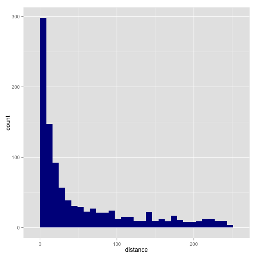 

```r
g + geom_histogram(aes(y = ..density..), fill = "darkblue") + geom_density() + 
    labs(x = "Distance", y = "Density") + scale_y_continuous(labels = percent)
```

```
## stat_bin: binwidth defaulted to range/30. Use 'binwidth = x' to adjust this.
```

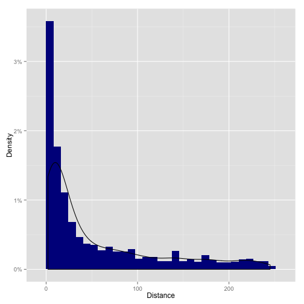 

```r
overdist = subset(motifs, motifs$distance > 250)
overdist
```

```
## [1] family     distance   size       phyloscore alignscore
## <0 rows> (or 0-length row.names)
```

Distance > 250 because of alignment. -> Counts "-" as 1 base.
Correlation between distance and sizes?


```r
g = ggplot(motifs, aes(x = size, y = distance)) + labs(x = "Motif Size", y = "Distance from TSS")
g + geom_point() + geom_density2d()
```

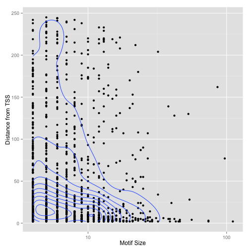 

```r
g + geom_density2d()
```

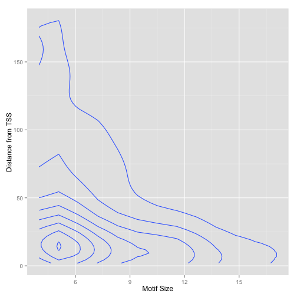 

```r
l = lm(distance ~ size, motifs)
summary(l)
```

```
## 
## Call:
## lm(formula = distance ~ size, data = motifs)
## 
## Residuals:
##    Min     1Q Median     3Q    Max 
##  -56.3  -46.6  -32.0   26.3  187.4 
## 
## Coefficients:
##             Estimate Std. Error t value Pr(>|t|)    
## (Intercept)   60.821      3.006   20.23   <2e-16 ***
## size          -0.636      0.231   -2.75    0.006 ** 
## ---
## Signif. codes:  0 '***' 0.001 '**' 0.01 '*' 0.05 '.' 0.1 ' ' 1
## 
## Residual standard error: 65.3 on 1025 degrees of freedom
## Multiple R-squared:  0.00733,	Adjusted R-squared:  0.00636 
## F-statistic: 7.57 on 1 and 1025 DF,  p-value: 0.00604
```

```r
g + geom_point() + coord_polar()
```

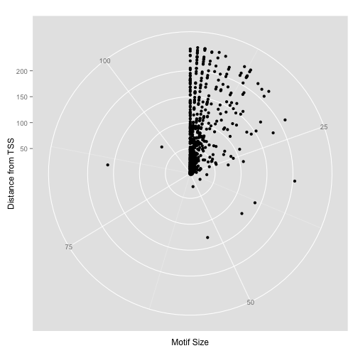 


Scores distribution?


```r
g = ggplot(motifs, aes(x = phyloscore, fill = "darkred"))
g + geom_histogram() + labs(x = "Phylogenetic Score") + scale_y_continuous()
```

```
## stat_bin: binwidth defaulted to range/30. Use 'binwidth = x' to adjust this.
```

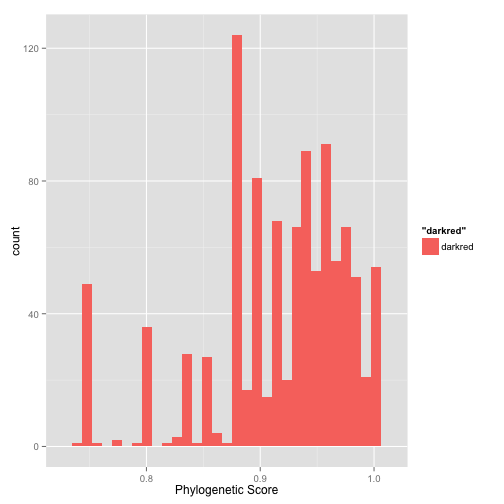 

```r
hist(motifs$phyloscore)
```

 

```r
quantile(motifs$phyloscore, c(0.05, 0.1, 0.25, 0.5, 0.75, 0.9, 0.95, 0.99))
```

```
##     5%    10%    25%    50%    75%    90%    95%    99% 
## 0.7750 0.8333 0.8750 0.9286 0.9615 0.9824 1.0000 1.0000
```

```r
g = ggplot(motifs, aes(x = alignscore)) + labs(x = "Alignment Score")
g + geom_histogram(aes(y = ..density.., fill = "darkred")) + geom_density()
```

```
## stat_bin: binwidth defaulted to range/30. Use 'binwidth = x' to adjust this.
```

```
## Warning: position_stack requires constant width: output may be incorrect
```

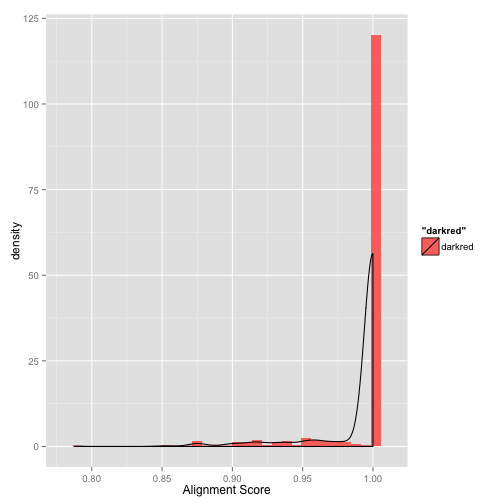 

```r
hist(motifs$alignscore)
```

 

```r
quantile(motifs$alignscore, c(0.01, 0.05, 0.1, 0.25, 0.5, 0.75, 0.9, 0.95, 0.99))
```

```
##     1%     5%    10%    25%    50%    75%    90%    95%    99% 
## 0.8750 0.9200 0.9583 1.0000 1.0000 1.0000 1.0000 1.0000 1.0000
```

Relation between Alignment and Phylogenetic score?

```r
g = ggplot(motifs, aes(x = phyloscore, y = alignscore))
g + geom_point()
```

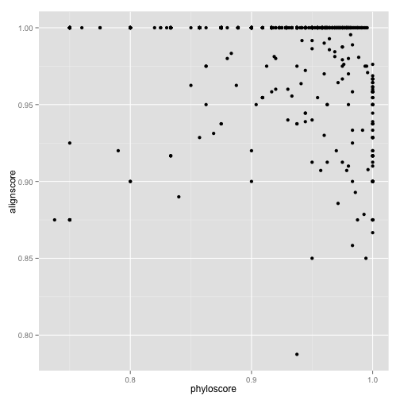 

```r
phyali = lm(phyloscore ~ alignscore, motifs)
summary(phyali)
```

```
## 
## Call:
## lm(formula = phyloscore ~ alignscore, data = motifs)
## 
## Residuals:
##     Min      1Q  Median      3Q     Max 
## -0.2198 -0.0382  0.0154  0.0451  0.0823 
## 
## Coefficients:
##             Estimate Std. Error t value Pr(>|t|)    
## (Intercept)   1.2658     0.0704   17.97  < 2e-16 ***
## alignscore   -0.3526     0.0711   -4.96  8.2e-07 ***
## ---
## Signif. codes:  0 '***' 0.001 '**' 0.01 '*' 0.05 '.' 0.1 ' ' 1
## 
## Residual standard error: 0.0612 on 1025 degrees of freedom
## Multiple R-squared:  0.0234,	Adjusted R-squared:  0.0225 
## F-statistic: 24.6 on 1 and 1025 DF,  p-value: 8.24e-07
```


Seems to have positive correlation between alignment and phylogenetic scores.


```r
gen = lm(distance ~ size + phyloscore + alignscore, motifs)
summary(gen)
```

```
## 
## Call:
## lm(formula = distance ~ size + phyloscore + alignscore, data = motifs)
## 
## Residuals:
##    Min     1Q Median     3Q    Max 
##  -73.8  -45.7  -29.2   28.2  183.8 
## 
## Coefficients:
##             Estimate Std. Error t value Pr(>|t|)   
## (Intercept)  -63.257     89.886   -0.70   0.4817   
## size          -0.412      0.258   -1.60   0.1107   
## phyloscore  -100.244     36.959   -2.71   0.0068 **
## alignscore   215.858     77.627    2.78   0.0055 **
## ---
## Signif. codes:  0 '***' 0.001 '**' 0.01 '*' 0.05 '.' 0.1 ' ' 1
## 
## Residual standard error: 64.7 on 1023 degrees of freedom
## Multiple R-squared:  0.0258,	Adjusted R-squared:  0.023 
## F-statistic: 9.03 on 3 and 1023 DF,  p-value: 6.59e-06
```
