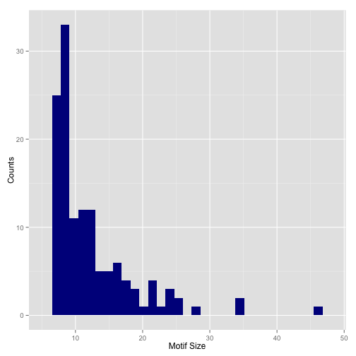
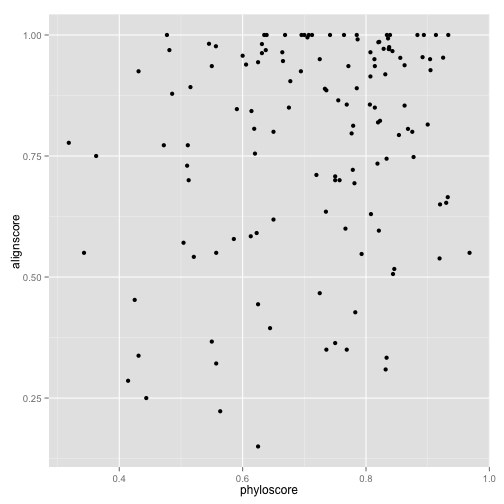

Motifs found
========================================================

Simple code to see what motifs were found.


```r
motifs = read.csv("../motifsscores.txt", sep = "\t", h = T)
head(motifs)
```

```
##         family distance size phyloscore alignscore
## 1 WGD2ANC00031       69   19     0.6132     0.5842
## 2 WGD2ANC00031      275   16     0.5906     0.8469
## 3 WGD2ANC00182       36   21     0.8429     0.9667
## 4 WGD2ANC00182       73   10     0.5100     0.7300
## 5 WGD2ANC00182      102   11     0.6227     0.5909
## 6 WGD2ANC00182      114    9     0.8389     1.0000
```


How many motifs are there? What distribution? What families are represented?


```r
library(ggplot2)
library(scales)
g = ggplot(motifs, aes(x = size))
g + geom_histogram(aes(y = ..density..), fill = "darkgreen") + geom_density() + 
    labs(x = "Motif Size", y = "Density") + scale_y_continuous(labels = percent)
```

```
## stat_bin: binwidth defaulted to range/30. Use 'binwidth = x' to adjust this.
```

 

```r
g + geom_histogram(fill = "darkblue") + labs(x = "Motif Size", y = "Counts")
```

```
## stat_bin: binwidth defaulted to range/30. Use 'binwidth = x' to adjust this.
```

 


```r
library(reshape)
```

```
## Loading required package: plyr
```

```
## Warning: package 'plyr' was built under R version 3.0.2
```

```
## 
## Attaching package: 'reshape'
## 
## L'objet suivant est masqué from 'package:plyr':
## 
##     rename, round_any
```

```r
cast(motifs, formula = ~family, fun.aggregate = mean)
```

```
## Using alignscore as value column.  Use the value argument to cast to override this choice
```

```
##   value WGD2ANC00031 WGD2ANC00182 WGD2ANC00311 WGD2ANC00387 WGD2ANC00451
## 1 (all)       0.7155       0.8219       0.7722            1       0.7479
##   WGD2ANC00488 WGD2ANC00492 WGD2ANC00505 WGD2ANC00530 WGD2ANC00581
## 1            1       0.7079        0.815       0.5958       0.9929
##   WGD2ANC00630 WGD2ANC00651 WGD2ANC00656 WGD2ANC00687 WGD2ANC00726
## 1       0.9389       0.7343       0.9531         0.75            1
##   WGD2ANC00907 WGD2ANC00928 WGD2ANC00949 WGD2ANC00958 WGD2ANC01001
## 1       0.8857       0.9625       0.4528       0.9187            1
##   WGD2ANC01066 WGD2ANC01102 WGD2ANC01294 WGD2ANC01412 WGD2ANC01495
## 1       0.7109       0.8542       0.5941       0.5062            1
##   WGD2ANC01530 WGD2ANC01532 WGD2ANC01563 WGD2ANC01568 WGD2ANC01574
## 1       0.8194       0.5708       0.5417       0.7773       0.3375
##   WGD2ANC01595 WGD2ANC01669 WGD2ANC01715 WGD2ANC01761 WGD2ANC01792
## 1          0.8       0.9571       0.9711       0.9437       0.2857
##   WGD2ANC01916 WGD2ANC01925 WGD2ANC01930 WGD2ANC01993 WGD2ANC02135
## 1       0.9045       0.8683            1       0.9215       0.9688
##   WGD2ANC02164 WGD2ANC02226 WGD2ANC02362 WGD2ANC02383 WGD2ANC02424
## 1       0.7933       0.9708         0.95       0.4272          0.8
##   WGD2ANC02466 WGD2ANC02555 WGD2ANC02636 WGD2ANC02697 WGD2ANC02721
## 1       0.5385       0.9883            1       0.9528       0.3333
##   WGD2ANC02833 WGD2ANC02862 WGD2ANC02942 WGD2ANC02960 WGD2ANC03003
## 1       0.3636       0.6937       0.5476        0.665       0.5786
##   WGD2ANC03049 WGD2ANC03059 WGD2ANC03088 WGD2ANC03116 WGD2ANC03129
## 1       0.3667          0.2       0.8853       0.3944       0.9375
##   WGD2ANC03139 WGD2ANC03145 WGD2ANC03316 WGD2ANC03407 WGD2ANC03436
## 1            1       0.7214       0.9714        0.925            1
##   WGD2ANC03453 WGD2ANC03483 WGD2ANC03603 WGD2ANC03636 WGD2ANC03671
## 1          0.7       0.8923         0.85       0.6767       0.9625
##   WGD2ANC03690 WGD2ANC03694 WGD2ANC03699 WGD2ANC03869 WGD2ANC03965
## 1       0.9357       0.9767       0.9643         0.55       0.8227
##   WGD2ANC04128 WGD2ANC04174 WGD2ANC04187 WGD2ANC04245 WGD2ANC04264
## 1       0.8786            1          0.7         0.95        0.815
##   WGD2ANC04356 WGD2ANC04473 WGD2ANC04677 WGD2ANC04783 WGD2ANC04815
## 1       0.7967       0.8969            1        0.755       0.8562
##   WGD2ANC04917 WGD2ANC04935 WGD2ANC04946 WGD2ANC04989 WGD2ANC05162
## 1       0.4667       0.9462         0.35        0.975       0.9143
##   WGD2ANC05188 WGD2ANC05217 WGD2ANC05243 WGD2ANC05283 WGD2ANC05287
## 1       0.7575       0.5167       0.8063       0.9357         0.55
##   WGD2ANC05311 WGD2ANC05446 WGD2ANC05453 WGD2ANC05475 WGD2ANC05510
## 1       0.6188       0.8429         0.45       0.8125       0.7925
##   WGD2ANC05562 WGD2ANC05614 WGD2ANC05654 WGD2ANC05655 WGD2ANC05657
## 1       0.9818       0.8731       0.9273       0.3091            1
##   WGD2ANC05674 WGD2ANC05718 WGD2ANC05721
## 1       0.2227       0.3214       0.9906
```

```r
quantile(motifs$size, c(0.05, 0.1, 0.25, 0.5, 0.75, 0.9, 0.95))
```

```
##   5%  10%  25%  50%  75%  90%  95% 
##  7.0  7.0  8.0 10.0 14.5 21.0 24.0
```

```r
summary(motifs)
```

```
##           family       distance          size        phyloscore   
##  WGD2ANC04473:  5   Min.   :  2.0   Min.   : 7.0   Min.   :0.318  
##  WGD2ANC00182:  4   1st Qu.: 18.5   1st Qu.: 8.0   1st Qu.:0.621  
##  WGD2ANC03088:  3   Median : 44.0   Median :10.0   Median :0.750  
##  WGD2ANC00031:  2   Mean   : 71.2   Mean   :12.2   Mean   :0.716  
##  WGD2ANC00505:  2   3rd Qu.: 82.5   3rd Qu.:14.5   3rd Qu.:0.832  
##  WGD2ANC01294:  2   Max.   :498.0   Max.   :46.0   Max.   :0.968  
##  (Other)     :113                                                 
##    alignscore   
##  Min.   :0.150  
##  1st Qu.:0.632  
##  Median :0.850  
##  Mean   :0.778  
##  3rd Qu.:0.964  
##  Max.   :1.000  
## 
```

```r

# Show the two families with maximum occurrences

motifs[motifs$family == "WGD2ANC04473", ]
```

```
##           family distance size phyloscore alignscore
## 96  WGD2ANC04473       24   22     0.6955     1.0000
## 97  WGD2ANC04473       65    8     0.4813     0.9688
## 98  WGD2ANC04473       81   13     0.9038     0.9500
## 99  WGD2ANC04473       98   25     0.8080     0.6300
## 100 WGD2ANC04473      125    7     0.8143     0.9357
```

```r
motifs[motifs$family == "WGD2ANC00182", ]
```

```
##         family distance size phyloscore alignscore
## 3 WGD2ANC00182       36   21     0.8429     0.9667
## 4 WGD2ANC00182       73   10     0.5100     0.7300
## 5 WGD2ANC00182      102   11     0.6227     0.5909
## 6 WGD2ANC00182      114    9     0.8389     1.0000
```

```r


# Show maximum and minimum
motifs[motifs$size == max(motifs$size), ]
```

```
##          family distance size phyloscore alignscore
## 52 WGD2ANC02383       18   46     0.7826     0.4272
```

```r
motifs[motifs$size == min(motifs$size), ]
```

```
##           family distance size phyloscore alignscore
## 8   WGD2ANC00387      227    7     0.7000     1.0000
## 15  WGD2ANC00581       92    7     0.8357     0.9929
## 21  WGD2ANC00907       40    7     0.7357     0.8857
## 38  WGD2ANC01669      448    7     0.6000     0.9571
## 41  WGD2ANC01792       27    7     0.4143     0.2857
## 44  WGD2ANC01925      246    7     0.8071     0.9643
## 56  WGD2ANC02555       76    7     0.8214     0.9857
## 64  WGD2ANC03003       47    7     0.5857     0.5786
## 68  WGD2ANC03088        9    7     0.8143     0.8500
## 74  WGD2ANC03145       34    7     0.7786     0.7214
## 75  WGD2ANC03316       12    7     0.8286     0.9714
## 82  WGD2ANC03636       44    7     0.7571     0.7000
## 85  WGD2ANC03690      337    7     0.5500     0.9357
## 87  WGD2ANC03699       32    7     0.6643     0.9643
## 88  WGD2ANC03869      112    7     0.3429     0.5500
## 90  WGD2ANC04128      251    7     0.4857     0.8786
## 100 WGD2ANC04473      125    7     0.8143     0.9357
## 101 WGD2ANC04677       57    7     0.7643     1.0000
## 106 WGD2ANC04946       20    7     0.7357     0.3500
## 108 WGD2ANC05162       19    7     0.8071     0.9143
## 113 WGD2ANC05283       10    7     0.7714     0.9357
## 116 WGD2ANC05446       43    7     0.6143     0.8429
## 118 WGD2ANC05453       14    7     0.5571     0.5500
## 129 WGD2ANC05718      149    7     0.5571     0.3214
## 130 WGD2ANC05721       81    7     0.7071     1.0000
```


What about the distribution of distance?


```r
g = ggplot(motifs, aes(x = distance))
g + geom_histogram(fill = "darkblue")
```

```
## stat_bin: binwidth defaulted to range/30. Use 'binwidth = x' to adjust this.
```

 

```r
g + geom_histogram(aes(y = ..density..), fill = "darkblue") + geom_density() + 
    labs(x = "Distance", y = "Density") + scale_y_continuous(labels = percent)
```

```
## stat_bin: binwidth defaulted to range/30. Use 'binwidth = x' to adjust this.
```

 

```r
overdist = subset(motifs, motifs$distance > 250)
overdist
```

```
##           family distance size phyloscore alignscore
## 2   WGD2ANC00031      275   16     0.5906     0.8469
## 30  WGD2ANC01412      266    8     0.8438     0.5062
## 37  WGD2ANC01595      498   14     0.6500     0.8000
## 38  WGD2ANC01669      448    7     0.6000     0.9571
## 85  WGD2ANC03690      337    7     0.5500     0.9357
## 90  WGD2ANC04128      251    7     0.4857     0.8786
## 128 WGD2ANC05674      251   11     0.5636     0.2227
```

Distance > 250 because of alignment. -> Counts "-" as 1 base.
Correlation between distance and sizes?


```r
g = ggplot(motifs, aes(x = size, y = distance)) + labs(x = "Motif Size", y = "Distance from TSS")
g + geom_point() + geom_density2d()
```

 

```r
g + geom_density2d()
```

 

```r
l = lm(distance ~ size, motifs)
summary(l)
```

```
## 
## Call:
## lm(formula = distance ~ size, data = motifs)
## 
## Residuals:
##    Min     1Q Median     3Q    Max 
##  -79.5  -47.9  -24.1   20.2  431.4 
## 
## Coefficients:
##             Estimate Std. Error t value Pr(>|t|)    
## (Intercept)   101.44      15.56    6.52  1.4e-09 ***
## size           -2.49       1.13   -2.20     0.03 *  
## ---
## Signif. codes:  0 '***' 0.001 '**' 0.01 '*' 0.05 '.' 0.1 ' ' 1
## 
## Residual standard error: 82.5 on 129 degrees of freedom
## Multiple R-squared:  0.0361,	Adjusted R-squared:  0.0286 
## F-statistic: 4.83 on 1 and 129 DF,  p-value: 0.0298
```

```r
g + geom_point() + coord_polar()
```

 


Scores distribution?


```r
g = ggplot(motifs, aes(x = phyloscore, fill = "darkred"))
g + geom_histogram() + labs(x = "Phylogenetic Score") + scale_y_continuous()
```

```
## stat_bin: binwidth defaulted to range/30. Use 'binwidth = x' to adjust this.
```

 

```r
hist(motifs$phyloscore)
```

 

```r
quantile(motifs$phyloscore, c(0.05, 0.1, 0.25, 0.5, 0.75, 0.9, 0.95, 0.99))
```

```
##     5%    10%    25%    50%    75%    90%    95%    99% 
## 0.4375 0.5100 0.6214 0.7500 0.8315 0.8833 0.9163 0.9331
```

```r
g = ggplot(motifs, aes(x = alignscore)) + labs(x = "Alignment Score")
g + geom_histogram(aes(y = ..density.., fill = "darkred")) + geom_density()
```

```
## stat_bin: binwidth defaulted to range/30. Use 'binwidth = x' to adjust this.
```

 

```r
hist(motifs$alignscore)
```

 

```r
quantile(motifs$alignscore, c(0.01, 0.05, 0.1, 0.25, 0.5, 0.75, 0.9, 0.95, 0.99))
```

```
##     1%     5%    10%    25%    50%    75%    90%    95%    99% 
## 0.2309 0.3354 0.4272 0.6325 0.8500 0.9643 1.0000 1.0000 1.0000
```

Relation between Alignment and Phylogenetic score?

```r
g = ggplot(motifs, aes(x = phyloscore, y = alignscore))
g + geom_point()
```

 

```r
phyali = lm(phyloscore ~ alignscore, motifs)
summary(phyali)
```

```
## 
## Call:
## lm(formula = phyloscore ~ alignscore, data = motifs)
## 
## Residuals:
##     Min      1Q  Median      3Q     Max 
## -0.3974 -0.1023  0.0385  0.0995  0.2867 
## 
## Coefficients:
##             Estimate Std. Error t value Pr(>|t|)    
## (Intercept)   0.5980     0.0460   13.01   <2e-16 ***
## alignscore    0.1512     0.0569    2.66   0.0088 ** 
## ---
## Signif. codes:  0 '***' 0.001 '**' 0.01 '*' 0.05 '.' 0.1 ' ' 1
## 
## Residual standard error: 0.143 on 129 degrees of freedom
## Multiple R-squared:  0.052,	Adjusted R-squared:  0.0446 
## F-statistic: 7.07 on 1 and 129 DF,  p-value: 0.00883
```


Seems to have positive correlation between alignment and phylogenetic scores.


```r
gen = lm(distance ~ size + phyloscore + alignscore, motifs)
summary(gen)
```

```
## 
## Call:
## lm(formula = distance ~ size + phyloscore + alignscore, data = motifs)
## 
## Residuals:
##    Min     1Q Median     3Q    Max 
## -105.1  -46.0  -26.0   18.7  423.6 
## 
## Coefficients:
##             Estimate Std. Error t value Pr(>|t|)   
## (Intercept)   119.12      40.51    2.94   0.0039 **
## size           -1.79       1.20   -1.49   0.1378   
## phyloscore    -83.99      53.46   -1.57   0.1186   
## alignscore     43.60      33.89    1.29   0.2006   
## ---
## Signif. codes:  0 '***' 0.001 '**' 0.01 '*' 0.05 '.' 0.1 ' ' 1
## 
## Residual standard error: 82.1 on 127 degrees of freedom
## Multiple R-squared:  0.0604,	Adjusted R-squared:  0.0382 
## F-statistic: 2.72 on 3 and 127 DF,  p-value: 0.0472
```

